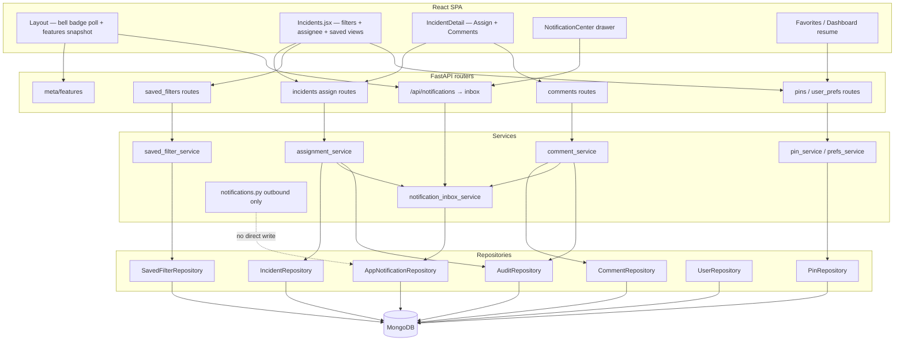
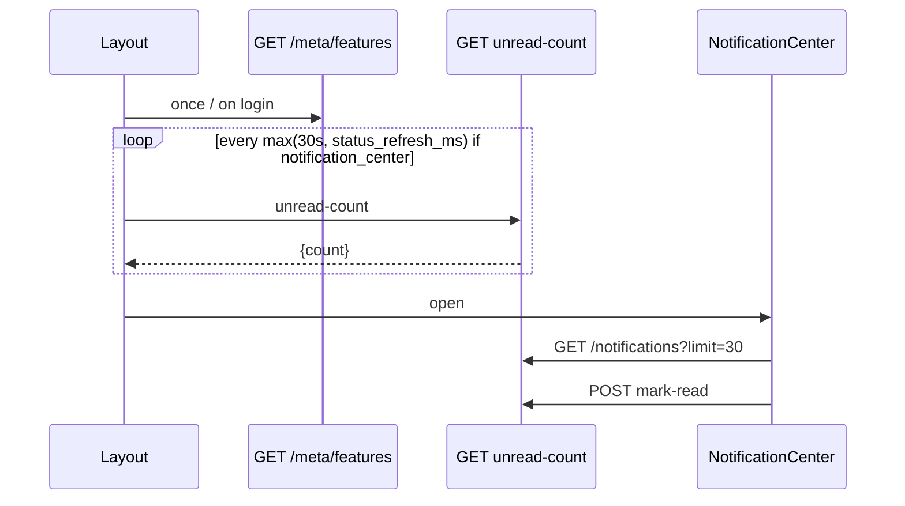
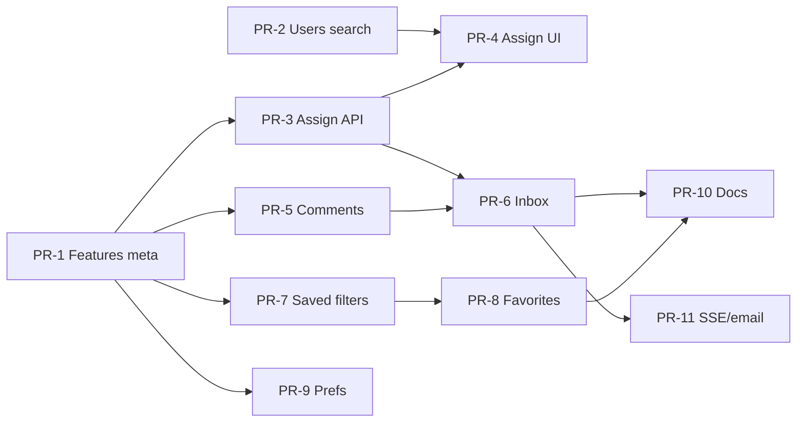

# ACTIRA v2.x — Collaboration & Productivity (H-07 + H-08)

| Field | Value |
|-------|--------|
| **Document** | Collaboration + Saved filters design |
| **Author** | _(engineering)_ |
| **Date** | 2026-07-27 |
| **Status** | **Implemented (MVP)** — design + PR-1…PR-8 surfaces shipped behind flags |
| **Product IDs** | **H-07** (Collaboration), **H-08** (Saved filters / workspaces / pins) |
| **Roadmap** | `ROADMAP.md` §H + seed `rm-v2-h07-h08-collab` |
| **Implementation** | **MVP complete** — enable `FEATURE_*` env vars (default off). Stretch: SSE inbox, email digests, secondary assignee UI. |

---

## Overview

ACTIRA today is a single-tenant Agentic SOC / IR command center (FastAPI + React + MongoDB) with a mature Investigation Workspace (notes notebook, timeline, entity graph, RCA, AI investigator) and a URL-synced, server-paginated Incidents list. Analysts lack **assignment ownership**, **collaborative discussion** distinct from investigation notes, **in-app awareness** of assignments / job outcomes, and **durable personal productivity aids** (saved filter sets, favorites/pins, light layout preferences).

This design proposes a coordinated **v2 Collaboration & Productivity** track that delivers:

1. **H-07** — Incident assignment, incident comments (beside—not replacing—workspace notes), and an in-app notification **inbox** (email optional later).
2. **H-08** — Named saved filters, user favorites/pins, and light personal layout preferences (not multi-org case workspaces).

The design reuses modular backend patterns (`routers → services → repositories`), existing JWT RBAC, append-only audit (`svc.audit` / `audit_repo`), and design-system tooltips. Multi-tenant `org_id` (H-01) is **not required for MVP** but every new collection and incident field is shaped so `org_id` can be added without rewrite. Multi-incident fan-out (N-05 / H-05) remains an **explicit non-goal**.

---

## Background & Motivation

### Current state (codebase anchors)

| Area | What exists today | Where |
|------|-------------------|--------|
| Incident model | `title`, `status`, `severity`, `created_by`, `reviewer_id`, `workspace` — **no assignee** | `backend/models.py` → `Incident` |
| List filters | **Server:** `status`, `severity`, `technique` via `_filter_query` (technique uses top-level `$or`). **Client-only:** `q`, `min_threat`, `hitl` in `Incidents.jsx` (forces non-server-paged mode when set). URL sync for all. | `incident_service.list_incidents`, `IncidentRepository._filter_query`, `frontend/src/pages/Incidents.jsx` |
| Investigation notes | Embedded `workspace.notes[]` with kinds `note` / `finding` / `recommendation`; `pinned` bool (notebook pin-to-top); author-scoped edit; max 200 | `WorkspaceNote`, `workspace_service`, `routers/workspace.py` |
| Workspace tabs | `WORKSPACE_TAB_IDS` = `case`, `evidence`, `timeline`, `assets`, `users`, `ti`, `mitre`, `notes`, `recommendations`, `playbooks` | `frontend/src/components/workspace/WorkspaceTabs.jsx` |
| HiTL | Atomic `claim_review` + audit `review.*`; review routes require `senior_reviewer` (admin superuser passes) | `review_service.apply_review`, `incidents_repo.claim_review` |
| Outbound alerts | Slack + email for high/critical/HiTL create — **not** an in-app inbox; module `backend/notifications.py`, logger `actira.notifications` | `notify_incident_created` |
| Retention | `purge_old_incidents` deletes **only** `incidents` by `created_at` | `backend/retention.py` |
| Auth roles | `analyst`, `senior_reviewer`, `admin` only (no `viewer` in `UserBase.role`) | `backend/models.py`, `auth.require_roles` |
| Rate limits | Login/IP throttle (`auth_throttle`); optional global IP RL (`GLOBAL_RATE_LIMIT_ENABLED`, off by default) — **no** per-user action counters | `server.py`, `auth_throttle.py` |
| Metrics | Simple JSON map on `GET /metrics` (e.g. `actira_incidents_total`) — not labeled Prom client counters | `server.py` → `metrics` |
| UI prefs | **localStorage** only (`actira_ui_prefs_v1`) | `frontend/src/lib/uiPrefs.js` |
| Layout poll | Settings chips refresh ≥30s floor | `Layout.jsx` + `status_refresh_ms` |
| Audit | Append + SHA-256 chain best-effort | `repositories/audit.py` |
| SSE | AI investigator + job phases only | `investigate_service` |
| Job completion | `job_queue.mark_queue_done(db, job_id, failed=…)` after worker finishes | `backend/job_queue.py` |

### Pain points

1. **No ownership** — Incidents have `created_by` and HiTL `reviewer_id`, but no primary IR owner, due date, or “my queue” filter.
2. **Notes ≠ collaboration** — Workspace notes are structured IR artifacts. Overloading `NoteKind` would blur evidence with chat.
3. **No in-app awareness** — Slack/email fire on create only.
4. **Filter friction** — Named, defaultable, multi-device filter sets do not exist; client-only filters also break server pagination.
5. **Favorites are ephemeral ideas** — Capstone listed pin/favorite incidents as localStorage; v2 should make them durable.

### Why v2 (not v1.x)

Roadmap marks H-07 / H-08 as 🔮 Future v2. Wave C and Investigation Workspace v1.4 are complete. Shipping collaboration without design risks audit gaps, note/comment conflation, and a rewrite when H-01 tenancy lands.

---

## Goals & Non-Goals

### Goals

| ID | Goal |
|----|------|
| G1 | Assign primary (+ optional secondary) owner and optional due/SLA **hint** on an incident; filter list by assignee (**including secondary** under `assignee=me`). |
| G2 | Threaded-lite comments on incidents with @mentions, distinct from workspace notebook notes. |
| G3 | In-app notification inbox: assignment, mention, comment reply, job done/fail for job owner. (**HiTL pending is not MVP** — see KD-11.) |
| G4 | Saved named filters for Incidents (extensible to Review / Hunt); private scope MVP; default filter per user. Server-persisted dimensions must match server-queryable list params (plus assignee). |
| G5 | User **favorites** (pins) for incidents, saved filters, and workspace tabs (valid `WORKSPACE_TAB_IDS` only). |
| G6 | Light personal layout preferences server-side (or hybrid) so multi-device resume works. |
| G7 | Full audit for assign / reassign / comment create-edit-delete / favorite create-delete. |
| G8 | RBAC for current roles: analysts self-assign + comment; senior_reviewer + admin full reassign. (No `viewer` role in MVP model.) |
| G9 | `org_id`-ready documents without requiring multi-tenant runtime. |
| G10 | Tooltip prerequisite on every new UI surface. |

### Non-Goals

| ID | Non-goal |
|----|----------|
| NG1 | Multi-incident fan-out (1 upload → N incidents) — **N-05**. |
| NG2 | Full case management / ServiceNow / Jira parity (SLA engines, CMDB, change tickets, escalation trees). |
| NG3 | Real-time collaborative editing (CRDT, presence cursors). |
| NG4 | Required Redis / Kafka / dedicated notification worker for MVP. |
| NG5 | Org-shared workspaces or multi-tenant isolation as a prerequisite for H-07/H-08 MVP. |
| NG6 | Email as primary channel for collaboration MVP (optional phase 2). |
| NG7 | Replacing Investigation Workspace notes with comments. |
| NG8 | Mobile native apps or push (FCM/APNs). |
| NG9 | SOAR action execution on assign (H-04 remains separate). |
| NG10 | In-app `hitl_pending` fan-out as MVP notification type (Review Queue remains primary). |

### Honesty (feature inventory)

When implemented, inventory rows should read:

- “Incident assign + comments + in-app notification inbox” — **Yes (v2)**  
- “Saved filters / favorites / personal layout prefs” — **Yes (v2)**  
- **Not** “enterprise case management” or “real-time collab suite.”

---

## Key Decisions

### KD-1 — Comments sit **beside** workspace notes (not a new `NoteKind`)

**Decision:** Collection `incident_comments` + APIs under `/incidents/{id}/comments`. Do **not** add `kind: "comment"` to `WorkspaceNote`.

**Rationale:** Notes are IR evidence (tags, linked IoCs/techniques/events, notebook `pinned` flag, 200 cap). Comments are team discussion (mentions, replies, soft-delete, higher volume). Mixing them couples investigation APIs to notification fan-out and pollutes RCA. Audit stays namespaced: `workspace.note.*` vs `incident.comment.*`.

### KD-2 — Shallow threading (one-level parent)

**Decision:** `parent_id` may point only to a **root** comment (depth ≤ 1). Nested reply-to-reply → 400.

### KD-3 — Assignment fields live on the **Incident** document

**Decision:** Optional fields: `assignee_id`, `assignee_email`, `secondary_assignee_id`, `secondary_assignee_email`, `due_at`, `sla_hint_hours`, `assigned_at`, `assigned_by_id`. History lives in **audit**, not an assignment-history subdocument.

**Status side effects:** **Assign does not change `status` in MVP** (no auto `new` → `in_progress`, no auto-approve). Never writes `reviewer_id` or interacts with `claim_review`.

**Concurrency:** MVP is **last-write-wins** (LWW). No `If-Match` / etag. Optional compare-and-set later if dual senior reassign becomes painful.

### KD-4 — In-app inbox is **not** `backend/notifications.py`

**Decision — hard split:**

| Concern | Module / store | Logger |
|---------|----------------|--------|
| **Outbound** Slack/email critical alerts | `backend/notifications.py`, email outbox files/Mongo sink | `actira.notifications` |
| **In-app inbox** | New: `repositories/app_notifications.py`, `services/notification_inbox_service.py`, collection **`app_notifications`** | `actira.notif_inbox` |

- HTTP product path may remain short: `GET /api/notifications` (inbox) — document that this is **inbox**, not outbound.
- **Forbid** writing inbox docs from `notify_incident_created` without an explicit adapter (e.g. `notification_inbox_service.emit(...)` called from collab services only).
- MVP transport: **HTTP poll** of unread-count + list (`before`/`after` cursor — **not** `since`). Optional SSE later. **No WebSockets.**
- Phase-2 email for collab: call outbound helpers from an adapter; never mix outbox records into `app_notifications`.

### KD-5 — Saved filters: server-queryable fields are source of truth

**Decision (MVP):**

- **Server-persisted / validated** on `SavedFilter.filter`: `status`, `severity`, `technique`, `assignee`, `unassigned` (and future server list params only).
- **Client-only extras** (`q`, `min_threat`, `hitl`) may be stored under `filter.client_only: {…}` as **opaque UX restore metadata**, with UI warning: *“Free-text / min threat / HiTL-only filters are applied in the browser and turn off server pagination.”*
- **Do not** pretend client-only fields are list API query params until a prerequisite PR promotes them server-side (optional stretch: promote `q` / `min_threat` / `hitl` in a separate PR).

**Pagination:** Applying a saved filter that only uses server fields keeps `serverPaged=true`. Any non-empty `client_only` forces the existing client-paged path (`Incidents.jsx` today).

### KD-6 — Favorites (user pins) and personal layout prefs are user-scoped collections

**Decision:**

- Collection `user_pins` — UI label **“Favorite”** / “Pin to dashboard” to avoid collision with `WorkspaceNote.pinned` (notebook pin-to-top).
- Audit actions: `user_pin.create` / `user_pin.delete`.
- `user_prefs` — multi-device layout; **does not** denormalize default saved filter (see KD-12).

### KD-7 — RBAC matrix (MVP roles only)

No `viewer` column until a formal role exists. Current roles:

| Action | analyst | senior_reviewer | admin |
|--------|---------|-----------------|-------|
| Read comments / inbox / own filters / own favorites | ✓ | ✓ | ✓ |
| Create comment | ✓ | ✓ | ✓ |
| Edit/delete own comment | ✓ | ✓ | ✓ |
| Edit/delete others’ comments | ✗ | ✓ | ✓ |
| Self-assign / unassign self (primary) | ✓ | ✓ | ✓ |
| Assign / reassign any user (primary) | ✗ | ✓ | ✓ |
| Set/clear secondary assignee | ✗ | ✓ | ✓ |
| Set/clear `due_at` / `sla_hint_hours` | ✓ only if currently primary assignee **or** self-assigning in same request | ✓ | ✓ |
| Saved filters CRUD (own) | ✓ | ✓ | ✓ |
| Favorites CRUD (own) | ✓ | ✓ | ✓ |

**Self-assign rule:** Analysts may set `assignee_id` only to their own `sub`, or clear primary if they are currently primary. Elevated may set any valid user id. Analysts **cannot** set secondary.

### KD-8 — Real-time: Poll → SSE → (not WS)

Job complete/fail: emit into `app_notifications` for `LogJob.created_by` from concrete hooks (see H-07.3), not only Slack.

### KD-9 — Feature flags: env + public meta snapshot + API enforce

**Decision:**

Env (default **off**):

```text
FEATURE_COLLAB_ASSIGN=0
FEATURE_COLLAB_COMMENTS=0
FEATURE_NOTIFICATION_CENTER=0
FEATURE_SAVED_FILTERS=0
FEATURE_PINS=0
```

**Expose path (concrete):** `GET /api/meta/features` (and `/api/v1/meta/features`) returns:

```json
{
  "collab_assign": false,
  "collab_comments": false,
  "notification_center": false,
  "saved_filters": false,
  "pins": false
}
```

Implementation: read env in `config/env.py` or a small `feature_flags.py`; mount on `routers/meta.py`. SPA loads once at login / Layout mount.

**API enforce:** When flag off, collab/productivity routes return **404** (feature absent) — not only hide UI. Dual-mount both `/api` and `/api/v1`.

### KD-10 — Soft-delete comments; never mutate audit chain

`deleted_at` + `deleted_by_id`; body redacted as `"[deleted]"` for non-elevated. Audit remains append-only.

### KD-11 — No MVP `hitl_pending` in-app type

**Decision:** Drop `hitl_pending` from MVP `NotificationType`. Review Queue remains the HiTL work surface. Assignment **must not** set `reviewer_id` or bypass `claim_review`. A future phase may add HiTL inbox events only when recipient role can open `/review` (elevated).

### KD-12 — Default saved filter: single source of truth

**Decision:** `SavedFilter.is_default` (at most one per `(owner_id, page)`) is the **only** source of truth. Do **not** store `default_saved_filter_id` on `user_prefs` in MVP. Client may cache the resolved default id in memory after `GET /saved-filters`.

### KD-13 — Filter query composition uses `$and` (never stomp `$or`)

Technique matching already uses top-level `$or`. “My queue (primary OR secondary)” needs `$or`. **All** disjunctions merge via `$and: [ … ]`. Writes never store `""` for assignee ids (use `null` only).

**Unassigned definition:** `unassigned=1` means **both** primary and secondary are empty (missing or `null`). A case with only a secondary owner is **not** unassigned. Symmetric with `assignee=me` (primary **or** secondary).

### KD-14 — Partial PATCH assignment uses `exclude_unset` + explicit clears

Omitted fields are not updated. Explicit `null` or `clear_*` clears. See H-07.1 for API examples.

**Clear-primary cascade:** When `assignee_id` is cleared (`null`) in a PATCH, the service **also clears secondary** (`secondary_assignee_id` / email → `null`) in the same write, unless the same request sets a new non-null `secondary_assignee_id` (elevated only). Rationale: secondary without primary is not a supported ownership state for list chips (“Unassigned” vs “Assigned to me”).

---

## Proposed Design

### Architecture overview



### Layering (modular monolith)

| Layer | New modules (proposed) |
|-------|------------------------|
| Config | `feature_flags.py` or `config/env.py` feature booleans |
| Models | `AssignmentUpdate`, Comment*, `AppNotification`, SavedFilter*, UserPin*, UserPrefs |
| Repositories | `comments.py`, **`app_notifications.py`**, `saved_filters.py`, `pins.py`, `user_prefs.py`; extend `incidents.py` filters + indexes |
| Services | `assignment_service.py`, `comment_service.py`, **`notification_inbox_service.py`**, `saved_filter_service.py`, `pin_service.py` |
| Routers | `collab.py` / extend `incidents.py`; `productivity.py`; `meta.py` features; dual-mount |
| Frontend | `NotificationCenter.jsx`, `AssignPanel.jsx`, `CommentsPanel.jsx`, `SavedFiltersBar.jsx`, favorite hooks; Layout bell |
| Retention | extend `retention.py` cascade |

Do **not** grow `server.py` with business logic. Do **not** import inbox types into `notifications.py` outbound module except via a thin adapter in phase 2 if needed.

---

### H-07.1 Assignment

#### Data model (incident fields)

```python
# Extensions on Incident (optional; extra="ignore" keeps old docs valid)
assignee_id: Optional[str] = None
assignee_email: Optional[str] = None  # denormalized for list UI
secondary_assignee_id: Optional[str] = None
secondary_assignee_email: Optional[str] = None
due_at: Optional[datetime] = None
sla_hint_hours: Optional[int] = Field(None, ge=1, le=720)
assigned_at: Optional[datetime] = None
assigned_by_id: Optional[str] = None
org_id: Optional[str] = None  # future; omit/null in single-tenant
```

**Write normalization:** On any assign write, never store empty string for ids; use `null` / field omit. Clears set fields to `null`.

#### API

| Method | Path | Body | Notes |
|--------|------|------|-------|
| `PATCH` | `/api/incidents/{id}/assignment` | `AssignmentUpdate` | Partial; `exclude_unset` |
| `GET` | `/api/incidents?assignee=me\|{user_id}&unassigned=1&…` | — | See filter composition |

```python
class AssignmentUpdate(BaseModel):
    """Partial update. Service MUST use model_dump(exclude_unset=True).

    Semantics:
    - Field omitted → leave unchanged.
    - assignee_id set to str → set primary (RBAC applies).
    - assignee_id set to null → clear primary **and cascade-clear secondary**
      (unless this same request sets secondary_assignee_id to a non-null id);
      also clear assigned_at/by unless primary is reassigned in the same request.
    - secondary_assignee_id str | null → set or clear secondary (elevated only).
      Setting secondary while primary is null is rejected with 400
      (“secondary requires primary”); clear-primary cascade is the supported path.
    - due_at datetime → set due.
    - clear_due=True → clear due_at (and sla_hint_hours if clear_sla_hint also true).
    - sla_hint_hours int | clear_sla_hint → set/clear hint.
    """
    model_config = ConfigDict(extra="ignore")
    assignee_id: Optional[str] = None
    secondary_assignee_id: Optional[str] = None
    due_at: Optional[datetime] = None
    sla_hint_hours: Optional[int] = Field(None, ge=1, le=720)
    clear_due: bool = False
    clear_sla_hint: bool = False
```

**Allowed operations (examples):**

```http
# Set primary only
PATCH /api/incidents/{id}/assignment
{ "assignee_id": "<user-uuid>" }

# Clear primary (also clears secondary — cascade)
PATCH /api/incidents/{id}/assignment
{ "assignee_id": null }

# Set secondary (elevated; primary must already be set)
PATCH /api/incidents/{id}/assignment
{ "secondary_assignee_id": "<user-uuid>" }

# Clear secondary only (primary remains)
PATCH /api/incidents/{id}/assignment
{ "secondary_assignee_id": null }

# Set due
PATCH /api/incidents/{id}/assignment
{ "due_at": "2026-08-01T17:00:00Z" }

# Clear due
PATCH /api/incidents/{id}/assignment
{ "clear_due": true }

# No-op / invalid wipe: empty body must not clear anything
PATCH /api/incidents/{id}/assignment
{ }
```

**Service rules (`assignment_service.set_assignment`):**

1. If feature flag off → 404.
2. Load incident; 404 if missing.
3. `patch = body.model_dump(exclude_unset=True)`.
4. RBAC (KD-7).
5. Resolve any new user ids via `users_repo.find_by_id_public` — 400 if unknown.
6. Build `$set` / `$unset` only for keys present in `patch` (plus denormalized emails, `assigned_at`/`assigned_by_id` when primary changes).
   - If primary is cleared → also clear secondary unless same request sets a new secondary (elevated).
   - If secondary is set while primary is empty after applying the patch → **400**.
7. **Do not change `status`.** Do not touch `reviewer_id` / playbook / HiTL fields.
8. Atomic update (LWW; no version check in MVP).
9. `svc.audit(..., "incident.assign", ..., detail={prev, next, fields_changed})`.
10. Emit inbox events via `notification_inbox_service` when notification flag on (skip self-notify).

**Closed/rejected:** Elevated may assign; analysts get 403 (OQ-3 closed as elevated-only).

#### List filter extension — `$and` composition

```python
def _filter_query(
    *,
    status=None,
    severity=None,
    technique=None,
    assignee=None,          # "me" | user_id
    unassigned: bool = False,
    current_user_sub: str | None = None,
) -> dict:
    and_terms: list[dict] = []
    if status:
        and_terms.append({"status": status})
    if severity:
        and_terms.append({"severity": severity})
    if technique:
        tid = technique.strip().upper()
        and_terms.append({
            "$or": [
                {"techniques.technique_id": tid},
                {"techniques.parent_id": tid},
                {"techniques.technique_id": {"$regex": f"^{re.escape(tid)}\\."}},
            ]
        })
    if unassigned:
        # BOTH primary and secondary empty (missing or null; writes never use "")
        and_terms.append({
            "$and": [
                {"$or": [
                    {"assignee_id": {"$exists": False}},
                    {"assignee_id": None},
                ]},
                {"$or": [
                    {"secondary_assignee_id": {"$exists": False}},
                    {"secondary_assignee_id": None},
                ]},
            ]
        })
    elif assignee == "me" and current_user_sub:
        # Primary OR secondary (G1) — unchanged
        and_terms.append({
            "$or": [
                {"assignee_id": current_user_sub},
                {"secondary_assignee_id": current_user_sub},
            ]
        })
    elif assignee:
        and_terms.append({
            "$or": [
                {"assignee_id": assignee},
                {"secondary_assignee_id": assignee},
            ]
        })

    if not and_terms:
        return {}
    if len(and_terms) == 1:
        return and_terms[0]
    return {"$and": and_terms}
```

**Unit tests required:**

- `technique + unassigned + status` (+ optional `assignee=me`) returns intersection, not last-`$or`-wins.
- **Primary null + secondary set → not matched by `unassigned`** (and is matched by `assignee=me` for that secondary user). After clear-primary cascade, such rows should not exist on write path; filter still defends reads/legacy data.
- Clear primary via PATCH also nulls secondary (unless same request sets new secondary).

**Indexes (on feature enable):**

```javascript
db.incidents.createIndex({ assignee_id: 1, created_at: -1 })
db.incidents.createIndex({ secondary_assignee_id: 1, created_at: -1 })
db.incidents.createIndex({ status: 1, assignee_id: 1 })
// future: { org_id: 1, assignee_id: 1, created_at: -1 }
```

#### Sequence — assign

```mermaid
sequenceDiagram
  participant UI as IncidentDetail
  participant API as PATCH /assignment
  participant S as assignment_service
  participant I as incidents_repo
  participant N as notification_inbox_service
  participant A as audit_repo

  UI->>API: AssignmentUpdate (partial)
  API->>S: set_assignment(id, body, user)
  S->>S: exclude_unset + RBAC + resolve user
  S->>I: $set / $unset assignment fields only
  Note over S,I: status unchanged; reviewer_id untouched
  S->>A: incident.assign
  S->>N: emit(type=assignment, user_id=assignee)
  S-->>UI: assignment projection
```

#### UI

- Incidents table: Assignee column; chips “Assigned to me” (primary **or** secondary), Unassigned (**neither** owner set).
- `AssignPanel` + `UserPicker` (`GET /users`).
- Tooltips: primary owner; due date is **not** an SLA engine.

---

### H-07.2 Comments

#### Data model (`incident_comments`)

```python
class IncidentComment(BaseModel):
    model_config = ConfigDict(extra="ignore")
    id: str = Field(default_factory=new_id)
    incident_id: str
    parent_id: Optional[str] = None
    body: str = Field(..., min_length=1, max_length=4096)
    author_id: str
    author_email: str
    mention_user_ids: List[str] = Field(default_factory=list, max_length=20)
    created_at: datetime = Field(default_factory=utc_now)
    updated_at: datetime = Field(default_factory=utc_now)
    deleted_at: Optional[datetime] = None
    deleted_by_id: Optional[str] = None
    org_id: Optional[str] = None
```

**Mentions:** Prefer validated `mention_user_ids` in body; never trust client-only. Cap 20.

**Limits (honest):**

- Soft cap **500 comments / incident**.
- **No existing per-user action throttle.** MVP: rely on optional global IP RL (`GLOBAL_RATE_LIMIT_ENABLED`) + mention cap + soft incident cap.
- Stretch: Mongo counter `{user_id, window}` or in-process token bucket (**multi-worker caveat**: not global without sticky/shared store). Do not claim `auth_throttle` covers comment create.

#### API

| Method | Path | Role |
|--------|------|------|
| `GET` | `/api/incidents/{id}/comments?before=&limit=50` | authenticated |
| `POST` | `/api/incidents/{id}/comments` | analyst+ |
| `PATCH` | `/api/incidents/{id}/comments/{cid}` | author or elevated |
| `DELETE` | `/api/incidents/{id}/comments/{cid}` | author or elevated (soft) |

Flag off → 404. Comment create does **not** require or mutate review state.

**Notification fan-out on create** (when notification center flag on):

| Event | Recipients |
|-------|------------|
| New root comment | primary + secondary assignees (≠ author) |
| Reply | parent author + mentions |
| Mentions | `mention_user_ids` (dedupe) |

#### UI

- Comments panel on Incident Detail; HelpTip: *“Team discussion. Use Notes for findings linked to IoCs and techniques.”*
- Do not use “pin” wording for comments; notebook keeps `WorkspaceNote.pinned`.

---

### H-07.3 Notification inbox

#### Data model (collection **`app_notifications`**)

```python
NotificationType = Literal[
    "assignment",
    "assignment_removed",
    "assignment_secondary",
    "mention",
    "comment_reply",
    "job_complete",
    "job_failed",
    "system",
]
# hitl_pending intentionally omitted from MVP (KD-11)

class AppNotification(BaseModel):
    id: str = Field(default_factory=new_id)
    user_id: str
    type: NotificationType
    title: str = Field(..., max_length=200)
    body: str = Field(..., max_length=1000)
    entity_type: str  # incident | job | comment
    entity_id: str
    incident_id: Optional[str] = None
    actor_id: Optional[str] = None
    actor_email: Optional[str] = None
    read_at: Optional[datetime] = None
    created_at: datetime = Field(default_factory=utc_now)
    meta: Dict[str, Any] = Field(default_factory=dict)
    org_id: Optional[str] = None
```

#### API (cursor model standardized)

| Method | Path | Notes |
|--------|------|-------|
| `GET` | `/api/notifications?unread=1&limit=30&before={iso_or_id}` | List; cursor = `before` (older) or `after` (newer); **no `since`** |
| `GET` | `/api/notifications/unread-count` | Badge only |
| `POST` | `/api/notifications/mark-read` | `{ids:[]}` or `{all: true}` |
| `DELETE` | `/api/notifications/{id}` | Hard delete OK for personal inbox |
| `GET` | `/api/notifications/stream` | Optional SSE stretch |

Indexes: `{user_id: 1, created_at: -1}`, `{user_id: 1, read_at: 1, created_at: -1}`.

#### Emission hooks (concrete)

| Source | When | Type | Recipient |
|--------|------|------|-----------|
| `assignment_service` | primary/secondary change | assignment* | new/old assignees |
| `comment_service` | create | mention / comment_reply | as above |
| **`job_queue.mark_queue_done`** | worker completion (`failed=True/False`) after job status final | `job_failed` / `job_complete` | `LogJob.created_by`; also primary assignee of each `incident_ids[]` if distinct (OQ-5) |
| Pipeline / incident create | **do not** dual-write inbox from `notify_incident_created` | — | outbound Slack/email only |

```python
# Pseudocode at end of mark_queue_done (flag-gated):
# await notification_inbox_service.emit_job_terminal(job_doc, failed=failed)
```

#### Poll strategy (MVP)



Optional SSE: server-side poll of `app_notifications` for `user_id` + `created_at > last` every 5–10s.

#### Retention (inbox + cascade)

**Inbox TTL:** delete read > 90d; unread > 180d; cap 500/user (drop oldest read first) — ops job in `retention.py` style.

**Incident purge cascade** (extend `purge_old_incidents` / `purge_from_settings`):

1. Query incident ids to delete (or use `delete_many` with prior `find` of ids if volume allows).
2. `incident_comments.delete_many({incident_id: {$in: ids}})`.
3. `app_notifications.delete_many({incident_id: {$in: ids}})` (or leave orphan deep-links that 404 — **prefer delete** for hygiene).
4. `user_pins.delete_many({target_type: "incident", target_id: {$in: ids}})` and `workspace_tab` pins whose `meta.incident_id` / `target_id` prefix matches.
5. Then delete incidents (existing).

Return counts in purge result: `incidents_deleted`, `comments_deleted`, `notifications_deleted`, `pins_deleted`.

Tests: retention cascade unit test with fake db collections.

#### UI

- Bell in Layout (only if `notification_center` feature true).
- Empty state: *“In-app alerts for assignments, mentions, and your jobs. Critical severity still uses Slack/email if configured.”*

---

### H-08.1 Saved filters

#### Data model (`saved_filters`)

```python
class ClientOnlyFilterExtras(BaseModel):
    """Browser-only dimensions — NOT passed to GET /incidents as server params."""
    model_config = ConfigDict(extra="ignore")
    q: Optional[str] = Field(None, max_length=200)
    min_threat: Optional[float] = Field(None, ge=0, le=100)
    hitl: Optional[bool] = None

class IncidentFilterSpec(BaseModel):
    """Server-queryable Incidents list dimensions (+ assignee)."""
    model_config = ConfigDict(extra="ignore")
    status: Optional[str] = None
    severity: Optional[str] = None
    technique: Optional[str] = Field(None, max_length=32)
    assignee: Optional[str] = None  # "me" or user id
    unassigned: Optional[bool] = None
    client_only: Optional[ClientOnlyFilterExtras] = None

class SavedFilter(BaseModel):
    id: str = Field(default_factory=new_id)
    owner_id: str
    name: str = Field(..., min_length=1, max_length=80)
    scope: Literal["private"] = "private"  # later: "org"
    page: Literal["incidents", "review", "hunt"] = "incidents"
    filter: IncidentFilterSpec
    is_default: bool = False  # SOT for default (KD-12)
    created_at: datetime = Field(default_factory=utc_now)
    updated_at: datetime = Field(default_factory=utc_now)
    org_id: Optional[str] = None
```

**Default rule:** At most one `is_default=True` per `(owner_id, page)`; setting default clears previous in same transaction/update.

**Share scope:** private only until H-01.

#### API

| Method | Path |
|--------|------|
| `GET` | `/api/saved-filters?page=incidents` |
| `POST` | `/api/saved-filters` |
| `PATCH` | `/api/saved-filters/{id}` |
| `DELETE` | `/api/saved-filters/{id}` |

#### UI (`Incidents.jsx`)

- Chips + “Save current filters…”; if `client_only` non-empty, show warning about pagination.
- On mount: if **no** URL filter params and default `is_default` exists → apply server fields to URL; apply `client_only` to local state.
- Do not override heatmap deep links.

**Stretch PR (optional, not blocking H-08 MVP):** promote `q` / `min_threat` / `hitl` into `IncidentRepository._filter_query` so full saved filters stay server-paged.

---

### H-08.2 Favorites (user pins)

#### Terminology

| Concept | Storage | UI copy |
|---------|---------|---------|
| Notebook note pin-to-top | `WorkspaceNote.pinned` | “Pin note” |
| User dashboard favorite | `user_pins` | **“Favorite”** / “Pin to dashboard” |
| Audit | `user_pin.create` / `user_pin.delete` | — |

#### Data model (`user_pins`)

```python
PinTargetType = Literal["incident", "saved_filter", "workspace_tab"]

# Allowlist MUST match frontend export:
WORKSPACE_TAB_ALLOWLIST = (
    "case", "evidence", "timeline", "assets", "users",
    "ti", "mitre", "notes", "recommendations", "playbooks",
)

class UserPin(BaseModel):
    id: str = Field(default_factory=new_id)
    user_id: str
    target_type: PinTargetType
    target_id: str  # incident id | saved_filter id | f"{incident_id}:{tab}"
    label: Optional[str] = Field(None, max_length=120)
    meta: Dict[str, Any] = Field(default_factory=dict)
    # workspace_tab: meta = { "incident_id": "...", "tab": "<WORKSPACE_TAB_ALLOWLIST>" }
    # Optional Case sub-panel deep link (not a tab id):
    # meta.panel ∈ {"rca", "graph", "investigator"} only when tab == "case"
    created_at: datetime = Field(default_factory=utc_now)
    org_id: Optional[str] = None
```

**Validation:** reject `meta.tab` not in allowlist (400). Resume URL: `/incidents/{id}?tab={tab}` (+ optional `panel=` for Case sub-panels handled by IncidentDetail if implemented later).

**Limits:** 50 / user; unique `(user_id, target_type, target_id)`.

#### API

| Method | Path |
|--------|------|
| `GET` | `/api/pins` |
| `POST` | `/api/pins` |
| `DELETE` | `/api/pins/{id}` |

#### UI

- Favorite icon on incident rows / detail; Dashboard + Command Palette “Favorites”.
- Star on saved filter chip.

---

### H-08.3 Light personal workspaces (prefs)

**Not** multi-tenant org workspaces.

```python
class UserPrefs(BaseModel):
    id: str  # == user_id
    user_id: str
    incidents_default_sort: Optional[str] = None
    incidents_default_severity: Optional[str] = None
    incidents_default_status: Optional[str] = None
    dashboard_layout: Optional[Dict[str, Any]] = None
    # NO default_saved_filter_id — use SavedFilter.is_default (KD-12)
    updated_at: datetime = Field(default_factory=utc_now)
    org_id: Optional[str] = None
```

**Merge:** local `uiPrefs` + `GET /api/me/prefs` (server wins for present keys). When `FEATURE_SAVED_FILTERS` on, default **list filter** comes from `SavedFilter.is_default`, which wins over bare `incidents_default_severity/status` for initial Incidents open (severity/status prefs still apply only if no default saved filter).

---

### Cross-cutting: Users list for pickers

```http
GET /api/users?q=&limit=20
```

Returns `{id, email, name, role}` — no password hashes. `UserRepository.search_public(q, limit)`. Required **before** AssignPanel UX (PR ordering).

---

### Feature flags plumbing

```python
# feature_flags.py (sketch)
def collab_features() -> dict[str, bool]:
    return {
        "collab_assign": env_bool("FEATURE_COLLAB_ASSIGN"),
        "collab_comments": env_bool("FEATURE_COLLAB_COMMENTS"),
        "notification_center": env_bool("FEATURE_NOTIFICATION_CENTER"),
        "saved_filters": env_bool("FEATURE_SAVED_FILTERS"),
        "pins": env_bool("FEATURE_PINS"),
    }
```

Router dependency: `require_feature("collab_assign")` → 404 if false.

---

### org_id readiness (H-01 coexistence)

| Collection / field | MVP | When H-01 lands |
|--------------------|-----|-----------------|
| All new docs | omit `org_id` or `null` | require on write from JWT/org context |
| Legacy incidents | no field | backfill job: set `org_id` for tenant; queries use `$or: [{org_id: X}, {org_id: null}]` only during migration window |
| Indexes | without org prefix | compound `(org_id, …)` |
| Unique names | `(owner_id, page, name)` | add org to unique key |

---

## API / Interface Changes

### Before / after — incident list

**Before:**

```http
GET /api/incidents?status=new&severity=high&technique=T1110&include_meta=true&skip=0&limit=25
```

**After (additive):**

```http
GET /api/incidents?status=new&assignee=me&unassigned=0&include_meta=true&skip=0&limit=25
```

### New route summary

```text
GET    /api/meta/features

PATCH  /api/incidents/{id}/assignment
GET    /api/incidents/{id}/comments
POST   /api/incidents/{id}/comments
PATCH  /api/incidents/{id}/comments/{cid}
DELETE /api/incidents/{id}/comments/{cid}

GET    /api/notifications                 # app_notifications inbox
GET    /api/notifications/unread-count
POST   /api/notifications/mark-read
DELETE /api/notifications/{id}
GET    /api/notifications/stream          # optional

GET|POST      /api/saved-filters
PATCH|DELETE  /api/saved-filters/{id}

GET|POST      /api/pins
DELETE        /api/pins/{id}

GET|PUT       /api/me/prefs
GET           /api/users?q=
```

Dual-mounted under `/api` and `/api/v1`. Flag-off → **404**.

### Audit actions (append-only)

| action | target_type | detail (examples) |
|--------|-------------|-------------------|
| `incident.assign` | incident | `{fields_changed, prev, next}` — no full wipe without fields |
| `incident.comment.create` | incident | `{comment_id, parent_id, mention_count}` + body preview ≤200 optional |
| `incident.comment.update` | incident | `{comment_id}` |
| `incident.comment.delete` | incident | `{comment_id}` |
| `saved_filter.create/update/delete` | saved_filter | `{name, page, is_default}` |
| `user_pin.create/delete` | user_pin | `{target_type, target_id}` |

---

## Data Model Changes

### Collections

| Collection | Purpose | Est. volume |
|------------|---------|-------------|
| `incidents` (fields) | assignment | existing |
| `incident_comments` | discussion | ~10–100 / active case |
| **`app_notifications`** | per-user inbox | ~10–50 / user / day |
| `saved_filters` | named views | ~5–20 / user |
| `user_pins` | favorites | ≤50 / user |
| `user_prefs` | layout prefs | 1 / user |

### Migration strategy

1. Optional fields; no downtime.
2. Indexes on flag enable / startup bootstrap.
3. Retention cascade registered with existing purge.
4. Rollback: flags off; data retained.

### Storage estimate

Unchanged order of magnitude (~20 MB comments/year; ~70 MB inbox steady-state before TTL) for small SOC.

---

## Alternatives Considered

### A1 — Comments as `WorkspaceNote` kind `"comment"`

**Rejected** (KD-1): conflates evidence with chat; 200 cap; soft-delete/threading poor fit for embedded arrays.

### A2 — Separate assignment history collection / event sourcing

**Rejected** for MVP; audit `incident.assign` is enough.

### A3 — WebSockets for notification push

**Rejected** (KD-4/KD-8). Poll + optional SSE.

### A4 — Saved filters only in localStorage

**Rejected** as sole solution; may cache only.

### A5 — Full org workspaces product surface

**Rejected** (NG2/NG5); light personal prefs only.

### A6 — Embed comments array on the incident document

| Pros | Cons |
|------|------|
| Same pattern as notes | Document size growth; 16 MB risk; concurrent `$push` contention; hard soft-delete pagination; couples list projections |

**Rejected** in favor of `incident_comments` collection.

### A7 — Use `audit_log` as the only notification feed

| Pros | Cons |
|------|------|
| No new collection | Audit is compliance-oriented, append-only, not per-user inbox; no read/unread; noisy for end users; role filters differ |

**Rejected.** Audit remains immutable compliance trail; inbox is ephemeral per-user UX state in `app_notifications`.

### A8 — Assignment as rich subdocument with embedded history

| Pros | Cons |
|------|------|
| Self-contained case history | Duplicates audit; larger incidents; list filters still need top-level fields |

**Rejected** for MVP; top-level assignee fields + audit history.

---

## Security & Privacy Considerations

| Threat | Severity | Mitigation |
|--------|----------|------------|
| Privilege escalation via assign-any | High | RBAC in `assignment_service`; analysts self-only |
| Mention / comment flood | Medium | Mention cap; incident comment cap; optional global IP RL; no fake “existing” per-user throttle claim |
| Comment XSS | High | Plain text; React escaping; no HTML |
| IDOR | High | Scope by user_id / incident; server-set author |
| PII in audit | Medium | Truncate comment bodies in audit detail |
| Feature flag bypass | High | API 404 when flag off, not UI-only |
| Tenant crossover (future) | Critical when multi-tenant | `org_id` on new docs; owner-scoped uniques |

**HiTL integrity:** Assign and comments never change `claim_review` semantics or `reviewer_id`. Soft-delete + redacted body compatible with append-only audit.

**Secrets:** No secrets in inbox bodies. Job failure messages sanitized.

---

## Observability

| Signal | Implementation |
|--------|----------------|
| Logs | `actira.collab`, `actira.notif_inbox` — counts only; no full comment bodies at INFO |
| Metrics (MVP) | Extend existing **JSON** `/metrics` map with gauges/counters such as `actira_app_notifications_total`, `actira_comments_total`, `actira_assignments_total` (simple integers, same style as `actira_incidents_total`). **Not** blocking on labeled Prometheus client histograms. |
| Metrics (stretch) | Prom client labeled counters if/when platform standardizes |
| Audit | actions above |
| Tracing | OTEL soft-dep spans on assign/comment |

**Latency targets (MVP, ≤50 concurrent users):**

| API | p95 target |
|-----|------------|
| unread-count | < 50 ms |
| list comments (50) | < 150 ms |
| assign | < 200 ms |
| saved-filters list | < 100 ms |
| meta/features | < 20 ms |

---

## Rollout Plan

### Phases

| Phase | Scope | Flag |
|-------|-------|------|
| **P0** | `GET /meta/features` + users search | (features always on for meta; users always) |
| **P1** | Assignment API + filters + UI | `FEATURE_COLLAB_ASSIGN` |
| **P2** | Comments API + UI | `FEATURE_COLLAB_COMMENTS` |
| **P3** | Inbox + emitters + Layout bell + retention cascade for notifs | `FEATURE_NOTIFICATION_CENTER` |
| **P4** | Saved filters (server fields + client_only metadata) | `FEATURE_SAVED_FILTERS` |
| **P5** | Favorites/pins (tab allowlist) | `FEATURE_PINS` |
| **P6** | user_prefs sync | optional |
| **P7** | SSE + email collab digests via outbound adapter | stretch |

### Feature flags & rollback

- Default off; API 404 + UI hide.
- Disable flags to roll back behavior; data retained.
- No destructive migrations.

### Testing strategy

- Unit: `$and` composition `technique+unassigned+status+assignee=me`; unassigned requires both owners empty; clear-primary cascade clears secondary; PATCH exclude_unset cases; RBAC matrix; soft-delete; default filter uniqueness; tab allowlist; retention cascade.
- API: flag-off 404; assign LWW; comments; inbox cursor `before`.
- Do not break: workspace notes, review 409, audit hash tests.

---

## PR Plan

Ordered for implementability. Each PR keeps main green with flags **off** (except meta/features always returns booleans).

| PR | Title | Depends | Backend | Frontend | Description | Status |
|----|-------|---------|---------|----------|-------------|--------|
| **PR-1** | feat(meta): feature flags snapshot | — | `feature_flags.py`, `routers/meta.py` `GET /meta/features`, tests | `lib/features.js` load once | Concrete flag expose path (KD-9) | ✅ PR #13 |
| **PR-2** | feat(collab): users public search | — (parallel PR-1) | `users_repo.search_public`, `GET /users`, tests | `UserPicker.jsx` | Typeahead for assign/mentions; **no** assign logic | 📋 Next |
| **PR-3** | feat(collab): assignment backend | PR-1 | Incident fields, `_filter_query` `$and`, `assignment_service`, PATCH route, audit, flag gate, tests incl. filter matrix | — | Backend-only assign; flag off → 404 | 📋 |
| **PR-4** | feat(collab): assignment UI | PR-2, PR-3 | — | `AssignPanel`, Incidents column/filters, tooltips | UX after typeahead + API exist | 📋 |
| **PR-5** | feat(collab): comments | PR-1 | `incident_comments`, comment service/router, audit, flag | `CommentsPanel`, HelpTips | Valuable without inbox | 📋 |
| **PR-6** | feat(collab): app_notifications inbox + emitters | PR-3, PR-5 | collection `app_notifications`, `notification_inbox_service`, hooks in `assignment_service`, `comment_service`, **`job_queue.mark_queue_done`**, retention cascade, flag | Layout bell, `NotificationCenter`, poll | Naming split from outbound `notifications.py` | 📋 |
| **PR-7** | feat(prod): saved filters | PR-1 | saved_filters models/repo/service; **server fields only** + `client_only` blob; `is_default` SOT | `SavedFiltersBar`, Incidents integrate + pagination warning | Parallelizable with PR-3+ after PR-1 | 📋 |
| **PR-8** | feat(prod): favorites (pins) | PR-7 for filter targets; PR-1 | `user_pins`, allowlist validation, retention pin cascade | favorite UI, Dashboard, palette | Tab IDs = `WORKSPACE_TAB_IDS` | 📋 |
| **PR-9** | feat(prod): user_prefs sync | PR-1 | `user_prefs` (no default filter denorm) | `uiPrefs` merge | Light workspaces | 📋 |
| **PR-10** | chore: OpenAPI + inventory + roadmap honesty | PR-6..9 | export openapi, roadmap notes | — | Docs | 📋 |
| **PR-11** | stretch: SSE + email digests | PR-6 | SSE; adapter to outbound `notifications.py` | EventSource optional | No inbox/outbox mix | 🔮 |

**Dependency graph:**



---

## Open Questions

| ID | Question | Options / recommendation |
|----|----------|---------------------------|
| OQ-1 | Introduce formal `viewer` role with H-07? | **Rec:** Not in this track; keep 3 roles. Matrix without viewer column. |
| OQ-2 | HiTL in-app notifications? | **Resolved for MVP:** omit `hitl_pending` (KD-11). Future: elevated-only recipients. |
| OQ-3 | Assign on `closed` / `rejected`? | **Rec:** elevated only; analysts 403. |
| OQ-4 | Markdown in comments? | **Rec:** plain text MVP. |
| OQ-5 | job_complete also notify incident assignees? | **Rec:** yes if `incident_ids` non-empty and ≠ `created_by`. |
| OQ-6 | Default filter vs uiPrefs severity/status | **Resolved:** `SavedFilter.is_default` wins when present (KD-12); no prefs denorm. |
| OQ-7 | Email for assignment phase 2 default? | **Rec:** off; opt-in. |
| OQ-8 | Comment edit timebox? | **Rec:** unlimited own edit MVP. |
| OQ-9 | Promote client-only list filters server-side? | **Rec:** separate stretch PR; not required for H-08 MVP with `client_only` metadata. |

---

## Risks

| Risk | Severity | Mitigation |
|------|----------|------------|
| Notification noise | Medium | No HiTL blast MVP; caps; mute later |
| `$or` filter bugs | High | KD-13 `$and` composition + unit tests |
| Accidental PATCH wipe | High | KD-14 exclude_unset + examples |
| Outbound vs inbox confusion | Medium | Collection `app_notifications`; logger `actira.notif_inbox`; adapter ban |
| Client-only saved filters vs pagination | Medium | KD-5 + UI warning |
| Orphan comments/pins after purge | High | Retention cascade (Issue 6 fix) |
| Concurrent reassign clobber | Low | LWW documented; CAS later |
| Scope creep ServiceNow | High | Non-goals; inventory honesty |
| Note `pinned` vs favorite confusion | Low | UI copy + audit `user_pin.*` |
| Multi-worker rate limit illusion | Low | Honest MVP limits (KD rate section) |

---

## Tooltip prerequisite (UI checklist)

| Surface | Tip content (examples) |
|---------|------------------------|
| Assign control | “Primary analyst responsible for this incident. Does not change review state.” |
| Due date | “Display hint only — ACTIRA does not run an SLA engine.” |
| Comments panel | “Team discussion. Use Notes for findings linked to IoCs and techniques.” |
| Notes notebook | Existing + “Not the same as Comments (collaboration).” |
| Bell / inbox | “Assignments, mentions, replies, and your job results — not Slack/email critical alerts.” |
| Saved filter save | “Stores list filters. Free-text / min-threat / HiTL-only extras apply in the browser and disable server pagination.” |
| Default filter toggle | “Applied when you open Incidents without a deep-link URL.” |
| Favorite incident | “Favorite for Dashboard and command palette (not the same as pinning a notebook note).” |
| Favorite workspace tab | “Resume this investigation tab (`?tab=` must be a real workspace tab).” |

Use `PageHeader` / `Panel` / `DsButton tooltip` / `Tip` / `HelpTip`.

---

## References

| Resource | Path |
|----------|------|
| Roadmap H-07 / H-08 | `ROADMAP.md` |
| Investigation Workspace design | `docs/product/INVESTIGATION_WORKSPACE_DESIGN.md` |
| Feature inventory | `docs/product/FEATURE_INVENTORY.md` |
| Backend structure | `docs/dx/BACKEND_STRUCTURE.md` |
| Tooltip policy | `docs/dx/TOOLTIP_PREREQUISITE.md` |
| Models | `backend/models.py` |
| Workspace notes | `backend/services/workspace_service.py` |
| Incident filters | `backend/services/incident_service.py`, `backend/repositories/incidents.py` |
| Retention | `backend/retention.py` → `purge_old_incidents` |
| Job completion | `backend/job_queue.py` → `mark_queue_done` |
| Workspace tabs | `frontend/src/components/workspace/WorkspaceTabs.jsx` → `WORKSPACE_TAB_IDS` |
| Audit chain | `backend/repositories/audit.py`, `backend/core/services.py` → `audit` |
| Outbound Slack/email | `backend/notifications.py` |
| HiTL review | `backend/services/review_service.py` |
| Auth / RBAC | `backend/auth.py`, `backend/security/__init__.py` |
| Metrics JSON map | `backend/server.py` → `GET /metrics` |
| Incidents UI | `frontend/src/pages/Incidents.jsx` |
| Layout poll | `frontend/src/components/Layout.jsx` |
| Client UI prefs | `frontend/src/lib/uiPrefs.js` |

---

## Revision Summary

| Rev | Date | Notes |
|-----|------|--------|
| 0 | 2026-07-27 | Initial draft |
| 1 | 2026-07-27 | Design review amendments: `$and` filter composition; PATCH `exclude_unset` + examples; `app_notifications` naming split; saved-filter server vs client_only; real `WORKSPACE_TAB_IDS`; retention cascade; PR reorder (features + users first); meta/features flag expose + API 404; assignee=me includes secondary; honest rate limits; drop MVP hitl_pending; default filter SOT; assign no status side effect; JSON metrics; cursor `before`/`after`; MVP RBAC without viewer fuzz; favorite vs note pin terminology; alternatives A6–A8; LWW concurrency |
| 2 | 2026-07-27 | `unassigned` = both primary and secondary empty; clear-primary cascades clear secondary; reject secondary without primary (400); unit tests for secondary-only vs unassigned |
