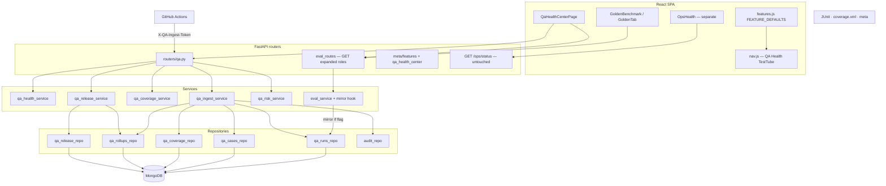
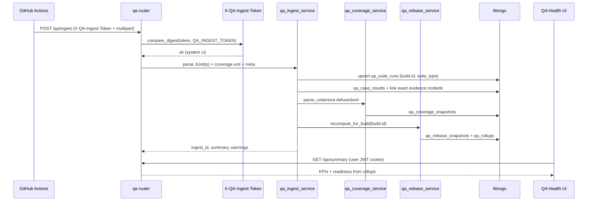
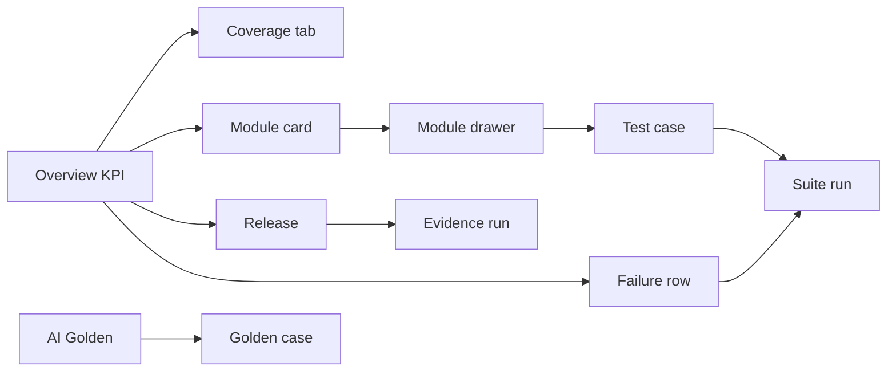

# ACTIRA Enterprise Testing Health Center (Quality Assurance & Test Center)

| Field | Value |
|-------|--------|
| **Document** | Testing Health Center / QA & Test Center design |
| **Author** | _(engineering)_ |
| **Date** | 2026-07-29 |
| **Status** | **Draft** (revised after design review) |
| **Product IDs** | **QA-01** (Testing Health Center), **QA-02** (CI artifact ingest), **QA-03** (Code coverage deep-dive), **QA-04** (Release readiness) |
| **Roadmap** | **To be added in PR-9** — seed id `rm-v2-qa-health-center` into `backend/roadmap_data.py` + `ROADMAP.md` §Quality (not present in repo yet) |
| **API source of truth** | Committed [openapi.json](../openapi.json) — paths below labeled **Proposed** until shipped; minimal paths land with PR-1/PR-3 |
| **Related designs** | [COLLABORATION_AND_SAVED_FILTERS_DESIGN.md](./COLLABORATION_AND_SAVED_FILTERS_DESIGN.md) (routers → services → repos, feature flags, honesty) |
| **Honesty** | [PRODUCT_HONESTY.md](./PRODUCT_HONESTY.md) — do not claim TestRail/ALM replacement or live multi-tenant QA SaaS |

---

## Overview

ACTIRA today has **fragmented quality signals**: offline golden IR eval (`/benchmark`, `backend/golden_eval.py`, Mongo `golden_runs`), ops runtime health (`GET /ops/status` → `ops_service.ops_status`, UI `/ops`), CI artifacts under `reports/` (JUnit XML, coverage HTML/XML/JSON), Playwright E2E, security suites (bandit, pip-audit, OWASP-oriented pytest), and a formal capstone catalog (`docs/capstone/appendices/A_test_case_catalog.md`). None of these surfaces is a **single source of truth** for release managers, QA, security test leads, or CXOs answering: *What was tested? How healthy is each module? Can we ship? What is coverage vs the 95% gate?*

This design proposes an **Enterprise Testing Health Center** (QA & Test Center) — an admin/senior-reviewer workspace at `/qa` that **ingests CI and local quality artifacts**, **aggregates module health and code coverage**, **computes auditable release readiness**, and **deep-links** existing Golden Eval without conflating it with **Ops & Health** (runtime). MVP prefers **artifact ingest + inventory seed** over re-implementing a full ALM/TestRail clone.

**Phase 0 MVP is deliberately narrower than the full IA** (see **Tab delivery matrix**): Overview, Suites, Catalog seed, Coverage **summary**, Release readiness, AI/Golden (read), Admin ingest. Remaining tabs ship in later phases—hidden from nav until their APIs exist.

---

## Background & Motivation

### Current state (codebase anchors)

| Area | What exists today | Where |
|------|-------------------|--------|
| Golden IR UI | Admin-only offline golden eval metrics, run history, dataset upload | `frontend/src/pages/GoldenBenchmark.jsx`, route `/benchmark` (`App.js`, `ADMIN_ROLES`) |
| Golden API | GET/POST `/eval/golden-benchmark` — **both currently `require_roles("admin")`**; persist `last` + history (~40 runs) | `backend/routers/eval_routes.py` (`from backend.security import require_roles`), `services/eval_service.py`, `golden_eval.py`, `core/services.slim_golden_payload` / `last_golden_run` |
| Ops Health | Runtime HA/queue/timings/LLM budget — **not** QA | `frontend/src/pages/OpsHealth.jsx`, `services/ops_service.py`, UI `/ops`, API **`GET /ops/status`** |
| Coverage gate | Line+branch backend; **fail_under = 95**; branch=`True`; source=`backend` | `.coveragerc` → `reports/coverage.xml`, `reports/coverage_html/`, also **`reports/coverage.json`** (unused by this design MVP); `make coverage` / `COV_FAIL ?= 95` |
| Unit/CI reports | JUnit XML under `reports/` | `Makefile` (`junit-unit.xml`, `junit-security.xml`, `junit-golden.xml`, …), `docs/TESTING.md` |
| E2E | Playwright smoke + workflow | `frontend/e2e/`, `docs/E2E_TESTING.md`, workflow `e2e.yml` |
| Security CI | bandit, pip-audit, security pytest | `.github/workflows/security.yml`, `make security` |
| Test inventory | Capstone markdown catalog (offline); **Module column ≠ health-module enum** | `docs/capstone/appendices/A_test_case_catalog.md` |
| AI eval framework | Metrics definitions + release gate | `docs/ai-governance/EVALUATION_FRAMEWORK.md`, `EVALUATION_METRICS.md` |
| Compliance evidence | `golden_eval`, `golden_eval_pass` keys (alignment, not CI SSOT) | `backend/compliance_catalog.py` AI-02 |
| Feature flags | Collab flags only; SPA merges only keys in `FEATURE_DEFAULTS` | `backend/feature_flags.py`, `frontend/src/lib/features.js`, `GET /api/meta/features` |
| Auth / roles | `analyst`, `senior_reviewer`, `admin`; JWT cookie **or** Bearer **JWT** | `backend/auth.py`; routers use **`from backend.security import require_roles`** |
| Design system | `PageHeader`, `Panel`, `KpiCard`, tooltips | `frontend/src/design-system/`, `docs/dx/TOOLTIP_PREREQUISITE.md` |
| Charts | Recharts + `useChartTheme` | `frontend/src/pages/Analytics.jsx` |
| Nav icons in use | Golden=`Flask`, Ops=`Heartbeat`, Compliance=`ShieldCheck`, Review=`ListChecks` | `frontend/src/constants/nav.js` |
| Multi-tenant | Scaffold only | `FEATURE_MULTI_TENANT`, `tenancy.py` |
| Frontend unit cov | CRA/Jest available; **no** production Istanbul/nyc pipeline in CI today | `frontend/package.json` `"test": "craco test"` |
| Audit | Append + SHA-256 chain best-effort | `repositories/audit.py` |
| Metrics | Prometheus-style helpers | `backend/metrics_registry.py` (`inc_counter`, `observe_histogram`) |
| XML deps | **No `defusedxml` today** | `backend/requirements.txt` |

### Pain points

1. **No release cockpit** — Release managers must stitch Actions, local `make ci`, Golden Eval, and coverage HTML manually.
2. **Coverage is opaque in-product** — Engineers open `reports/coverage_html/` on disk; CXOs never see gate distance (95%).
3. **Test inventory is documentation-only** — Capstone catalog is not queryable, not linked to last run results.
4. **Golden vs Ops confusion risk** — Both live under Admin; product must keep **runtime** vs **quality** hard-separated.
5. **Security/perf signals are CI-local** — Bandit/pip-audit/Playwright artifacts are not summarized for reviewers inside ACTIRA.
6. **No trend surface for quality** — Golden has a small history strip; unit/coverage/e2e/security lack durable product trends.
7. **CI coverage is often soft** — `docs/TESTING.md`: suite may be below 95% today; CI coverage job informational unless `COV_STRICT=1`. Product READY must not silently contradict that without dual-mode UX.

### Why now

Wave C / Investigation Workspace / collab productivity patterns are established. Enterprise pilots and board reviews ask for **evidence of quality systemization** without claiming SIEM/SOAR replacement. A QA Health Center is the honest answer: **ingest what CI already produces**, surface it with ACTIRA design-system UX, and keep human release authority.

---

## Goals & Non-Goals

### Goals

| ID | Goal |
|----|------|
| G1 | Single **Testing Health Center** UI. **Full G1 (all tabs/RTM/security)** is multi-phase; **Phase 0** delivers tested/untested (catalog + suites), module health (mapped), failures, release readiness, basic trends, coverage **summary** (see Tab delivery matrix). |
| G2 | Ingest **JUnit XML**, **coverage XML** (coverage.py Cobertura), **golden run** summaries (mirror), optional security/Playwright artifacts from CI/local uploads. |
| G3 | Seed **test case inventory** from a **committed JSON fixture** (generated offline from capstone); link results via **exact nodeid in `evidence[]`** only; CRUD-lite for status/owner (not full ALM). |
| G4 | Deterministic, auditable **release readiness** algorithm with READY / NOT_READY (no CONDITIONAL) and checklist evidence. |
| G5 | **Risk scoring** per module/suite with severity and flaky signals (best-effort from history / rollups). |
| G6 | **Code coverage**: MVP summary (overall/backend, gate gap); Phase 1 deep-dive (file/package, trends, HTML link). Frontend when available; else N/A. |
| G7 | RBAC: MVP **admin + senior_reviewer** read QA; **admin** write/ingest; senior_reviewer may export (capped); **GET golden expanded to senior_reviewer**; POST golden remains admin-only. Analyst later optional. |
| G8 | Feature flag `FEATURE_QA_HEALTH_CENTER` (default off); backend `FEATURE_ENV_MAP` + SPA **`FEATURE_DEFAULTS.qa_health_center`**; 404 when disabled. **Do not rename** `collab_features()`. |
| G9 | Golden Benchmark: **AI/Golden tab** + dual `/benchmark` entry; Ops Health **never** merged. |
| G10 | Tooltip prerequisite on every KPI, filter, primary action, and module card. |
| G11 | `org_id`-ready documents without requiring multi-tenant runtime. |
| G12 | Export CSV/JSON (MVP, row-capped); PDF/Excel (Enterprise phase). |
| G13 | OpenAPI dual-mount `/api` + `/api/v1`; modular routers → services → repositories. |
| G14 | Compliance bridge: quality evidence keys for AI-02 / future QA catalog rows (Compliance remains alignment SSOT, not CI quality). |

### Non-Goals

| ID | Non-goal |
|----|----------|
| NG1 | Full TestRail / Zephyr / qTest / Azure Test Plans clone (test plan trees, cycles UI parity, requirements ALM). |
| NG2 | Live multi-tenant QA SaaS, billing, or customer-shared quality tenants. |
| NG3 | Replacing GitHub Actions / Azure DevOps as the **runner** of tests (ACTIRA aggregates results). |
| NG4 | Merging Ops Health (`/ops` / `/ops/status`) into Testing Health. |
| NG5 | Inventing frontend coverage numbers when no Istanbul/nyc/Jest coverage pipeline exists (show **N/A** honestly). |
| NG6 | Automatic production deploy on READY (human + external CD remains authority). |
| NG7 | Real-time browser recording or live load-test orchestration inside ACTIRA. |
| NG8 | Jira/ADO work item sync as MVP requirement (optional Enterprise connectors). |
| NG9 | Growing `server.py` with QA business logic. |
| NG10 | Claiming formal certification from this surface (alignment / evidence only). |
| NG11 | Runtime markdown parsing of capstone catalog on the API hot path (offline JSON fixture only). |
| NG12 | Using `Authorization: Bearer` for CI shared-secret ingest (JWT-only Bearer path). |

### Honesty (feature inventory)

When implemented, inventory should read:

- “Testing Health Center — CI artifact ingest, coverage, release readiness” — **Yes (v2)**
- “Golden IR eval (existing)” — **Yes (shipped; embedded tab + expanded GET for senior_reviewer)**
- **Not** “enterprise ALM / TestRail replacement” or “live continuous testing SaaS.”
- **Not** “Compliance page is the CI quality cockpit” — Compliance = product-alignment scoring.

---

## Key Decisions

### KD-1 — Testing Health ≠ Ops Health

**Decision:** Separate route `/qa` (nav label **QA Health**), separate APIs under `/qa/*` and `/api/v1/qa/*`. Ops remains UI `/ops` → API **`GET /ops/status`** → `ops_service.ops_status` (queue, HA, LLM budget, pipeline timings).

**Rationale:** Different personas and SLAs. Mixing quality with runtime creates false “green ops = ready to release” conclusions.

**Nav icon:** Phosphor **`TestTube`** (or `ClipboardText` if `TestTube` unavailable)—**not** `ShieldCheck` (Compliance), `ListChecks` (Review), or `Flask` (Golden Eval).

### KD-2 — Ingest-first, not execute-first

**Decision:** MVP **does not** re-run the full suite inside the API process (except existing golden POST and optional thin “refresh last golden”). Primary path: **upload or CI push** of artifacts → parse → store → score.

**Rationale:** Matches ACTIRA offline-first philosophy (`docs/TESTING.md`); avoids long-running pytest inside uvicorn workers; reuses GitHub Actions / `make ci` as system of execution.

### KD-3 — Golden Benchmark relationship + RBAC (Option B)

**Decision:**

| Surface | Behavior |
|---------|----------|
| Nav | **QA Health** primary Admin quality entry (`admin` + `senior_reviewer`, flag-gated). **Golden Eval** remains dual entry `/benchmark` for admin; optional later soft redirect to `/qa?tab=ai-golden`. |
| Tab inside QA Center | **AI / Golden** tab reuses metrics help from `GoldenBenchmark.jsx` (`METRIC_HELP`) and calls **`GET /eval/golden-benchmark`**. |
| **GET** `/eval/golden-benchmark` | Expand to **`admin`, `senior_reviewer`** so release evidence and Golden tab work for reviewers. |
| **POST** `/eval/golden-benchmark` | Remains **admin only** (run is expensive / dataset-sensitive). |
| Data | Continue `golden_runs`; **mirror** last slim summary into `qa_suite_runs` (`source: golden_mirror`) from **`eval_service.run_golden_benchmark` after persist** (single write path; flag-gated). History prune (~40) unchanged. |

**Rationale (prefer Option B over mirror-only):** Senior reviewers need to **see** the same golden metrics that feed READY/NOT_READY. Expanding GET is a one-line role change + OpenAPI/tests; avoids a second incomplete golden UI. Option A (admin-only evidence) would force senior_reviewer to trust a score without drill-down—unacceptable for G7/G9.

**Also update:** `App.js` if dual-entry `/benchmark` should allow senior_reviewer read-only (recommended: yes, same roles as GET); `test_rbac_matrix`-style tests; OpenAPI.

### KD-4 — Feature flag (extend, do not rename)

```text
FEATURE_QA_HEALTH_CENTER=0   # default off
```

| Layer | Change |
|-------|--------|
| Backend | Add `"qa_health_center": "FEATURE_QA_HEALTH_CENTER"` to `FEATURE_ENV_MAP` in `feature_flags.py`. Keep function name **`collab_features()`** (or add thin alias `product_features = collab_features` **only if** useful—**do not** rename call sites / tests casually). |
| Meta | Key appears in `GET /api/meta/features` automatically via map. |
| SPA | Add `qa_health_center: false` to **`FEATURE_DEFAULTS`** in `frontend/src/lib/features.js` (unknown API keys are **ignored** today). |
| Nav / page | Gate with `isFeatureEnabled("qa_health_center")` **and** roles. |
| API | `require_feature("qa_health_center")` → **404** when off. |

### KD-5 — Roles MVP (resolved matrix)

| Action | analyst | senior_reviewer | admin |
|--------|---------|-----------------|-------|
| View QA dashboard / coverage / readiness / suites / catalog | ✗ (phase 2+ optional ✓) | ✓ | ✓ |
| View AI/Golden tab + **GET** golden-benchmark | ✗ | ✓ | ✓ |
| **POST** run golden / dataset upload | ✗ | ✗ | ✓ |
| Ingest artifacts (UI or CI token) | ✗ | ✗ | ✓ (UI); CI uses service token |
| Seed/update inventory (status/notes/owner) | ✗ | ✓ (status/notes/linked_bug only) | ✓ |
| Export (row-capped) | ✗ | ✓ | ✓ |
| Delete runs / retention admin / env write | ✗ | ✗ | ✓ |
| `/benchmark` page | ✗ | ✓ (read; after role expand) | ✓ |

### KD-6 — Coverage gate constant + dual-mode READY policy

**Decision:** Product display gate constant `CODE_COVERAGE_GATE = 95` must match `.coveragerc` `fail_under` and `Makefile` `COV_FAIL`.

**Product READY uses Cobertura root `line-rate` percent** as the coverage gate input; **branch rate is shown separately** (not dual-threshold for READY unless later policy adds it). This matches common pytest-cov Cobertura export and avoids inventing a second composite.

**Unified vocabulary (one concept, two planes):**

| Plane | Knob | Default | Meaning |
|-------|------|---------|---------|
| **CI gate** | GitHub/repo `COV_STRICT` | off (informational coverage job) | Whether CI job fails when &lt; 95% |
| **Product READY gate** | `QA_READINESS_COVERAGE_MODE` | **`soft`** for lab/MVP pilots; **`hard`** recommended for release-tag sign-off | Whether coverage &lt; 95% forces `NOT_READY` |

Deprecated / do **not** invent parallel names: `COV_SOFT`, `QA_READINESS_COVERAGE_HARD` as separate boolean—use **`QA_READINESS_COVERAGE_MODE=soft|hard`** only. CI `COV_STRICT` remains CI-only; ingest meta may optionally pass `ci_cov_strict: true|false` for display on the snapshot.

**UI copy (always):** “Org coverage gate is 95% (`.coveragerc` / `make coverage`). CI may still be green if `COV_STRICT≠1`. Product READY mode: {soft|hard}.”

**Risk:** Chronic NOT_READY desensitizes reviewers when suite is still climbing to 95%. **Mitigation:** default `soft` in MVP lab; hard for release tags / production claims; banner when soft and coverage fails.

### KD-7 — Test inventory is a **catalog + last result**, not a full TMS

**Decision:** Collection `qa_test_cases` holds catalog fields; execution truth lives in `qa_suite_runs` + `qa_case_results`. Automated results win when a newer matching run exists (timestamp precedence) **and** a link rule matched.

**Seed:** Committed JSON fixture `backend/data/qa_catalog_seed_v1.json` (generated offline from capstone). Runtime does **not** parse markdown.

**Link rules (normative):**

1. If `qa_case_results.nodeid` **exactly equals** any string in `qa_test_cases.evidence[]` → set `test_case_id`.
2. Else leave `test_case_id: null` (Suites still show the failure; Catalog may stay `not_run`).
3. No fuzzy title matching in MVP. Admin bulk-map API is Phase 1+.

**Automation %** uses catalog `automation` labels, **not** pytest discovery count.

### KD-8 — Environments are labels, not live topology probes

**Decision:** `qa_environments` documents (DEV/QA/SIT/UAT/Perf/Prod) store version/branch/commit/image as **declared or CI-supplied** metadata. Do not scrape Kubernetes from this page (Ops Health / deploy docs own runtime topology).

### KD-9 — Defects: GitHub Issues primary

**Decision:** MVP links `bug_url` / `github_issue_number` as free-form or structured refs. Optional Jira later. No mandatory GitHub App for MVP; paste URL is enough. Defects **tab** is Phase 1 (not Phase 0 nav).

### KD-10 — Release readiness is deterministic and pure

**Decision:** Pure function of stored suite snapshots + coverage + open critical defects + golden pass. Same inputs → same READY/NOT_READY. All inputs versioned in `qa_release_snapshots` for audit. **No CONDITIONAL verdict** in v1—use NOT_READY + `soft_warnings[]`.

### KD-11 — Storage realism (single-tenant pilot)

| Artifact type | Retention default | Approx size/run |
|---------------|-------------------|-----------------|
| Suite run summary | 180 days | 5–50 KB |
| Coverage file rollups | 90 days (keep last 50 builds) | 100–500 KB JSON (packages); raw XML optional 1–5 MB |
| Per-test case results | 90 days | 200–800 KB if full junit |
| Golden history | existing ~40 runs | small |
| HTML coverage blob | optional object/path ref, not Mongo BSON if >1 MB | store path/URL |

Cap: prune like golden history; **`purge_old_qa_artifacts`** in `retention.py` (PR-3).

### KD-12 — AI recommendations are advisory

**Decision:** Rule-based + optional LLM narrative behind same HiTL honesty as rest of product. Never auto-block release solely on LLM prose — only on deterministic algorithm (KD-10).

### KD-13 — CI ingest auth: `X-QA-Ingest-Token` only (not Bearer)

**Decision:** `POST /qa/ingest` accepts **either**:

1. **Admin user session** (cookie JWT or Bearer **JWT** as today via `get_current_user` + `require_roles("admin")`), **or**
2. **Service path:** header **`X-QA-Ingest-Token: <secret>`** compared with `hmac.compare_digest` (constant-time) to env `QA_INGEST_TOKEN`. When token auth succeeds, **skip user JWT**. Attribute `ingested_by = {"system": "ci", "kind": "ingest_token"}`. Rate-limit by IP + token (reuse patterns from `auth_throttle` if practical).

**Forbidden:** Putting the shared secret in `Authorization: Bearer …` (ACTIRA Bearer path is JWT decode).

**Rotation:** Rotate `QA_INGEST_TOKEN` via env/secret store; never log token value; audit detail stores only `auth: "ingest_token"` / sha256 prefix of token id if needed—not the secret.

**MVP optional:** Lab can use Admin UI multipart only; CI step is documented when token provisioned.

### KD-14 — Module map is versioned config (`qa_module_map_v1`)

**Decision:** Health modules are a fixed enum. Capstone “Module” column and JUnit paths map through **normative Appendix C** (`qa_module_map_v1`). Unmapped → `module: "Unmapped"` **excluded from \(Q\)** with weight renormalization + honesty banner. Map version is stored on each release snapshot for score auditability.

### KD-15 — Multi-suite build correlation

**Decision:**

1. One `qa_suite_runs` document per **`(build.id, suite_type)`** (upsert on re-ingest).
2. Coverage snapshots keyed by **`build.id`** (or commit if no build id).
3. After **every** successful ingest (or coverage upload) for a build, call **`recompute_for_build(build_id)`**.
4. Hard gates resolve evidence **per suite_type**: prefer run with matching `build.id`; else latest by `finished_at` within age window when `build.id` missing (local upload).
5. Snapshot `checklist[].evidence_run_id` lists exact ids used.
6. Optional **batch** multipart: multiple `junit_*` files + one `coverage` + one `meta` in a single POST (CI convenience).
7. Concurrency: upsert by `(build.id, suite_type)`—not a single lock that blocks other suite types.

### KD-16 — XML parsing requires `defusedxml`

**Decision:** Add **`defusedxml`** to `backend/requirements.txt` / `requirements-test.txt` as needed. Parsers use `defusedxml.ElementTree`. PR-2 acceptance: hostile fixtures (external entity, billion-laughs-ish oversized) rejected safely. Do not use bare lxml or unprotected `xml.etree` for untrusted upload.

### KD-17 — Rollups, not undefined `qa_summary_cache`

**Decision:** On each ingest/recompute, write/update a single **`qa_rollups`** document (id `latest` + optional per-build). Overview `GET /qa/summary` reads rollups + latest `qa_release_snapshots`—**no** separate undefined `qa_summary_cache` collection name. Flaky detection: maintain `qa_rollups.flaky_nodeids[]` (top N) updated from last 10 results per nodeid at ingest time (avoid expensive ad-hoc scans on summary GET).

---

## Tab delivery matrix

| Tab | Phase 0 MVP | Phase 1 Enterprise | Later |
|-----|-------------|--------------------|-------|
| Overview | **Visible** — KPIs, module grid, trend sparklines, recent failures, soft warnings | + AI recommendations panel polish | Forecasting |
| Suites & Runs | **Visible** — list/detail | Filters polish | — |
| Test Catalog | **Visible** — seed + list/detail + last status | Bulk-map nodeids | — |
| Code Coverage | **Visible summary** — % / gap / gate / backend; package top-N | **Full** file drill-down, HTML serve, multi-build trend | FE coverage composite |
| Release Readiness | **Visible** | PDF memo | — |
| AI / Golden | **Visible** (GET metrics + history; POST run admin) | — | Live LLM narrative |
| Admin / Ingest | **Visible** (admin) | CI token docs live | — |
| Modules (dedicated) | **Hidden** — use Overview module cards → drawer | Optional full tab | — |
| Traceability (RTM) | **Hidden** | **Visible** | — |
| Security & Performance | **Hidden** (security junit still feeds readiness if ingested) | **Visible** summary panels | ZAP/Trivy/Dependabot |
| Environments | **Hidden** | **Visible** CRUD | — |
| Defects | **Hidden** (linked_bug on case still patchable) | **Visible** list | Jira sync |
| Exports entry | Overview/Admin action menu | Excel | PDF |

**PR-4 shell:** Overview + Release + Suites list stub + Admin ingest empty-state + Golden tab + Coverage summary. Do **not** render nav chips for hidden tabs.

**Phase 0 engineering:** multi-sprint (explicitly **~4–6 weeks** for a small team: PR-1…PR-4 + PR-6 seed + golden expand + PR-3 ingest), not a single weekend PR.

---

## Proposed Design

### 1. Information architecture

```
/qa  (Testing Health Center)
├── Overview (Executive)          # default — MVP
├── Suites & Runs                 # MVP
├── Test Catalog                  # MVP
├── Code Coverage                 # MVP summary → Phase 1 deep-dive
├── AI / Golden                   # MVP (GET expanded)
├── Release Readiness             # MVP
├── Admin / Ingest                # MVP admin
├── Modules                       # Phase 1 optional (drawer from Overview in MVP)
├── Traceability (RTM)            # Phase 1
├── Security & Performance        # Phase 1
└── Environments                  # Phase 1
```

**Nav placement** (`frontend/src/constants/nav.js`): Admin section, roles `["admin","senior_reviewer"]`, icon **`TestTube`**, tip: “Quality, coverage, release readiness — not runtime ops (`/ops`).” Gate: `isFeatureEnabled("qa_health_center")`.

**Deep links:**

- `/qa?tab=coverage&pkg=backend.pipeline` (pkg effective Phase 1)
- `/qa?tab=ai-golden`
- `/qa?tab=release&build=abc123`
- `/benchmark` remains; banner “Also under QA Health → AI / Golden”

### 2. Complete page layout (wireframe-level)

#### Shell

```
┌──────────────────────────────────────────────────────────────────────────┐
│ PageHeader: Testing Health Center                                        │
│ tipTitle/tipBody: SSOT for quality vs Ops Health; last ingest time       │
│ Actions: [Ingest artifacts] [Refresh] [Export ▾] [Run golden] (RBAC)     │
├──────────────────────────────────────────────────────────────────────────┤
│ Tab strip (only delivered tabs per matrix)                               │
├──────────────────────────────────────────────────────────────────────────┤
│ Filter bar: env · branch · build · time range · suite type · search      │
│ (PaneLabel + HelpTip on every control)                                   │
├──────────────────────────────────────────────────────────────────────────┤
│ Tab content                                                              │
└──────────────────────────────────────────────────────────────────────────┘
```

#### Overview tab

```
┌─ KPI row 1 ──────────────────────────────────────────────────────────────┐
│ Quality Score │ Release Ready │ Pass% │ Fail/Skip │ Coverage % + gap     │
│ Open defects* │ Auto%*        │ Sec*  │ AI golden │ (* N/A until data)   │
└──────────────────────────────────────────────────────────────────────────┘
│ Banner when QA_READINESS_COVERAGE_MODE=soft and coverage < 95%           │
┌─ Quality score by module (10 cards; Unmapped excluded from Q) ───────────┐
│ Backend Frontend API AI Security Perf UX Database DevOps Docs            │
└──────────────────────────────────────────────────────────────────────────┘
┌─ Trends ─────────────────────────┬─ Release checklist ───────────────────┐
│ Pass rate + coverage sparklines  │ READY / NOT_READY badge               │
│ Golden IoC F1 when mirrored      │ Hard gates + soft_warnings[]          │
└──────────────────────────────────┴───────────────────────────────────────┘
┌─ Recent failures table ──────────────────────────────────────────────────┐
└──────────────────────────────────────────────────────────────────────────┘
```

#### Code Coverage tab

**MVP:** KPIs (overall/backend/frontend N/A, gate 95%, gap, branch %), last snapshot meta, top uncovered packages (from rollup), link to HTML artifact if ref present, honesty about soft/hard READY mode.

**Phase 1:** Full file table, missing lines drawer, multi-build trend, critical path list.

#### Release Readiness tab

```
┌─ Banner: READY | NOT_READY ──────────────────────────────────────────────┐
├─ soft_warnings[] (e.g. coverage soft fail, e2e not required) ────────────┤
├─ Checklist (deterministic gates) + evidence run ids ─────────────────────┤
└─ Export release memo (JSON/CSV; PDF later) ──────────────────────────────┘
```

No CONDITIONAL state in UI.

### 3. Component hierarchy

```
QaHealthCenterPage.jsx
├── PageHeader (tipTitle, tipBody, actions with DsButton tooltip)
├── QaTabNav (delivered tabs only)
├── QaFilterBar
├── tabs/ (lazy)
│   ├── OverviewTab
│   ├── SuitesTab
│   ├── CatalogTab
│   ├── CoverageTab (summary → deep-dive)
│   ├── GoldenTab (shared hooks with GoldenBenchmark.jsx)
│   ├── ReleaseTab
│   └── AdminIngestTab
├── ListState / LoadingState
└── ExportMenu (row caps)
```

Hooks: `useQaFeatures()`, `useQaSummary(filters)`, `useCoverage(buildId)`, `useReleaseReadiness(buildId|latest)`.

### 4. Architecture overview



### 5. Sequence: CI ingest → readiness



### 6. Data model and APIs

#### 6.1 Mongo collections (schema)

##### `qa_suite_runs`

```python
{
  "id": "run_…",
  "org_id": None,
  "source": "ci" | "upload" | "local_make" | "golden_mirror",
  "suite_type": "unit" | "integration" | "security" | "e2e" | "golden" | "performance" | "lint" | "coverage_gate" | "other",
  "category": "Functional" | "API" | "Database" | "AI" | "Security" | "Performance" | "UI" | "DevOps" | "DR",
  "name": "pytest-unit",
  "status": "passed" | "failed" | "partial" | "error",
  "counts": {"total": 0, "passed": 0, "failed": 0, "skipped": 0, "blocked": 0, "errors": 0},
  "duration_s": 12.4,
  "started_at": "ISO",
  "finished_at": "ISO",
  "env": "CI" | "DEV" | "QA" | "SIT" | "UAT" | "Perf" | "Prod",
  "build": {
    "id": "gha-123",           # required for CI correlation; optional local
    "branch": "main",
    "commit": "abc1234",
    "image": "actira:sha-…",
    "ci_run_url": "https://github.com/…/actions/runs/…",
    "workflow": "ci.yml"
  },
  "artifacts": [{"kind": "junit", "filename": "junit-unit.xml", "sha256": "…", "bytes": 1234}],
  "failures_sample": [{"name": "…", "message": "…", "classname": "…"}],  # truncated
  "ingested_at": "ISO",
  "ingested_by": {"id": "…", "email": "…"} | {"system": "ci", "kind": "ingest_token"},
  "raw_ref": None,
  "module_map_version": "qa_module_map_v1",
}
```

**Upsert key:** `(build.id, suite_type)` when `build.id` present; else new id each local upload.

Indexes: `(build.id, suite_type)`, `(finished_at desc)`, `(suite_type, finished_at)`, `(build.commit)`.

##### `qa_case_results`

```python
{
  "id": "cr_…",
  "run_id": "run_…",
  "test_case_id": "TC-AUTH-001" | None,  # only if evidence exact match
  "nodeid": "tests/unit/test_x.py::test_y",
  "name": "test_y",
  "classname": "…",
  "module": "Backend" | "Frontend" | "API" | "AI" | "Security" | "Performance"
            | "UX" | "Database" | "DevOps" | "Documentation" | "Unmapped",
  "status": "passed" | "failed" | "skipped" | "error" | "blocked",
  "duration_s": 0.01,
  "message": "…",           # truncated ≤2KB
  "system_out": None,       # truncated; secret-redacted
  "build_id": "…",
  "finished_at": "ISO",
}
```

Indexes: `(run_id)`, `(test_case_id, finished_at)`, `(nodeid, finished_at)`, `(status, finished_at)`, `(module, finished_at)`.

##### `qa_test_cases` (inventory)

```python
{
  "id": "TC-AUTH-001",
  "title": "Login valid analyst",
  "module": "Security",             # health module via qa_module_map_v1
  "feature": "Auth",
  "category": "Security",
  "priority": "P0" | "P1" | "P2" | "P3",
  "severity": "critical" | "high" | "medium" | "low",
  "type": "Functional" | "Security" | "API" | "UI" | "Performance" | "AI/RAG" | "Integration",
  "automation": "auto" | "semi" | "manual",
  "owner": None,
  "status": "pass" | "fail" | "blocked" | "skipped" | "not_run",
  "last_run_at": None,
  "last_run_id": None,
  "last_duration_s": None,
  "last_build": None,
  "last_env": None,
  "linked_bug": None,
  "requirement_ids": ["CAP-AUTH", "AI-02"],
  "description": "…",
  "expected": "…",
  "actual_last": "…",
  "evidence": [
    "backend/tests/test_hardening.py::test_login_valid"
  ],
  "source": "capstone_seed_json" | "manual",
  "catalog_module_raw": "test_hardening",  # original capstone Module cell
  "org_id": None,
  "updated_at": "ISO",
  "updated_by": "…",
}
```

##### `qa_coverage_snapshots`

```python
{
  "id": "cov_…",
  "build": { "id", "branch", "commit", "ci_run_url" },
  "captured_at": "ISO",
  "gate_percent": 95.0,
  "gate_metric": "cobertura_line_rate",  # product READY uses this
  "backend": {
    "line_rate": 0.9123,
    "branch_rate": 0.8801,
    "lines_valid": 12000,
    "lines_covered": 10948,
    "branches_valid": 4000,
    "branches_covered": 3520,
    "percent": 91.23,
    "gap_to_gate": 3.77,
    "gate_passed": False
  },
  "frontend": {
    "available": False,
    "line_rate": None,
    "branch_rate": None,
    "percent": None,
    "note": "No Istanbul/nyc CI artifact ingested"
  },
  "overall": {
    "percent": 91.23,
    "composition": "backend_only" | "weighted"
  },
  "packages": [
    {"name": "backend.pipeline", "line_rate": 0.94, "branch_rate": 0.90,
     "lines_valid": 800, "lines_covered": 752}
  ],
  "files": [],  # MVP may store top-N only; Phase 1 full pagination store
  "critical_gaps": [],
  "html_artifact_ref": "reports/coverage_html/index.html" | None,
  "xml_sha256": "…",
  "path_normalization": "backend_prefix",  # see coverage UX
  "source": "upload" | "ci",
  "ci_cov_strict": None,  # optional from meta
}
```

Critical path config:

```text
QA_COVERAGE_CRITICAL_PREFIXES=backend/auth.py,backend/hitl_gate.py,backend/pipeline.py,backend/golden_eval.py,backend/security
```

Omitted paths (never expected in UI): `backend/tests/*`, `backend/scripts/*`, `lora_train.py` per `.coveragerc`.

##### `qa_rollups`

```python
{
  "id": "latest",  # or "build:{build_id}"
  "updated_at": "ISO",
  "build_id": "…" | None,
  "module_scores": {"Backend": 82.0, "AI": 90.0, …},
  "quality_score": 78.4,
  "grade": "C",
  "pass_rate": 0.96,
  "automation_pct": 72.0,
  "coverage_percent": 91.23,
  "unmapped_case_count": 12,
  "flaky_nodeids": [{"nodeid": "…", "flips": 3}],
  "module_map_version": "qa_module_map_v1",
  "recent_failure_ids": ["cr_…"],
}
```

##### `qa_environments` (Phase 1 write UI; seed optional)

```python
{
  "id": "env_qa",
  "name": "QA",
  "kind": "QA",
  "version": "2.x-dev",
  "branch": "main",
  "commit": "abc1234",
  "image": "actira:…",
  "last_deploy_at": None,
  "notes": "Pilot single-tenant",
  "updated_at": "ISO",
  "updated_by": "…",
}
```

##### `qa_release_snapshots`

```python
{
  "id": "rel_…",
  "computed_at": "ISO",
  "build": {…},
  "verdict": "READY" | "NOT_READY",
  "score": 82.5,
  "grade": "B",
  "coverage_mode": "soft" | "hard",
  "ci_cov_strict": None,
  "module_map_version": "qa_module_map_v1",
  "checklist": [
    {"id": "unit_pass", "label": "Unit suite passed", "passed": True,
     "hard": True, "weight": 1.0, "evidence_run_id": "run_…"},
    {"id": "coverage_gate", "label": "Coverage ≥ 95%", "passed": False,
     "hard": False, "value": 91.2, "threshold": 95,
     "evidence_coverage_id": "cov_…"}
  ],
  "blockers": [],           # hard failures only
  "soft_warnings": [
    "coverage_gate: 91.2 < 95.0 (mode=soft; does not force NOT_READY)"
  ],
  "inputs": {
    "unit_run_id": "…",
    "golden_run_id": "…",
    "security_run_id": "…",
    "coverage_id": "…",
    "open_critical_defects": 0
  },
  "inputs_hash": "sha256…",
  "algorithm_version": "qa-readiness-v1",
}
```

##### `qa_defects` (Phase 1 primary UI)

```python
{
  "id": "def_…",
  "title": "…",
  "severity": "critical" | "high" | "medium" | "low",
  "status": "open" | "closed",
  "url": "https://github.com/…/issues/N",
  "provider": "github" | "jira" | "manual",
  "linked_test_ids": ["TC-…"],
  "module": "Backend",
  "created_at": "ISO",
  "updated_at": "ISO",
}
```

#### 6.2 API surface (Proposed)

Imports for new router:

```python
from backend.security import require_roles
from backend.feature_flags import require_feature
```

All `/qa/*` routes: `require_feature("qa_health_center")` + RBAC.

| Method | Path | Roles / auth | Purpose | Phase |
|--------|------|--------------|---------|-------|
| GET | `/qa/healthz` | flag only | 200 when flag on | 0 / PR-1 |
| GET | `/qa/summary` | admin, senior_reviewer | KPIs from rollups + readiness | 0 |
| GET | `/qa/runs` | admin, senior_reviewer | Paginated suite runs | 0 |
| GET | `/qa/runs/{id}` | admin, senior_reviewer | Run detail | 0 |
| GET | `/qa/cases` | admin, senior_reviewer | Catalog list | 0 |
| GET | `/qa/cases/{id}` | admin, senior_reviewer | Case detail | 0 |
| PATCH | `/qa/cases/{id}` | admin; senior_reviewer limited | notes/status/linked_bug | 0 |
| GET | `/qa/coverage` | admin, senior_reviewer | Latest or `?build=` summary | 0 |
| GET | `/qa/coverage/packages` | admin, senior_reviewer | Package rollup | 0 summary / 1 deep |
| GET | `/qa/coverage/files` | admin, senior_reviewer | File table | **1** |
| GET | `/qa/coverage/trend` | admin, senior_reviewer | Time series | **1** |
| GET | `/qa/release/latest` | admin, senior_reviewer | Latest readiness | 0 |
| GET | `/qa/release/{id}` | admin, senior_reviewer | Snapshot | 0 |
| POST | `/qa/release/recompute` | admin | Force recompute | 0 |
| POST | `/qa/ingest` | **admin JWT/cookie** OR **`X-QA-Ingest-Token`** | Multipart / batch | 0 |
| POST | `/qa/seed/catalog` | admin | Load JSON fixture | 0 |
| GET | `/qa/exports/summary` | admin, senior_reviewer | `format=json\|csv`; **max 10k rows** | 0 |
| GET | `/qa/modules` | admin, senior_reviewer | Module scores | 0 (from rollups) |
| GET | `/qa/traceability` | admin, senior_reviewer | RTM | **1** |
| GET | `/qa/security-summary` | admin, senior_reviewer | Bandit/etc if ingested | **1** |
| GET | `/qa/performance-summary` | admin, senior_reviewer | Perf + honesty | **1** |
| GET/PUT | `/qa/environments` | read both; write admin | Env meta | **1** |
| GET/POST | `/qa/defects` | read both; write admin | Defects | **1** |
| GET | `/qa/recommendations` | admin, senior_reviewer | Advisory rules | **1** |

**Golden (contract change — documented):**

| Method | Path | Roles (after change) |
|--------|------|----------------------|
| GET | `/eval/golden-benchmark` | **admin, senior_reviewer** |
| POST | `/eval/golden-benchmark` | **admin** only |

Mirror hook: **`eval_service.run_golden_benchmark`** after Mongo persist (not router-only), if `is_feature_enabled("qa_health_center")`.

**Ingest meta.json example:**

```json
{
  "source": "ci",
  "suite_type": "unit",
  "category": "Functional",
  "name": "pytest-unit",
  "env": "CI",
  "ci_cov_strict": false,
  "build": {
    "id": "123456789",
    "branch": "main",
    "commit": "abc1234deadbeef",
    "ci_run_url": "https://github.com/org/repo/actions/runs/123456789",
    "workflow": "ci.yml"
  }
}
```

**Batch:** multiple files `junit`, `junit_security`, `coverage`, `meta`.

#### 6.3 Service / module layout

| Layer | Modules |
|-------|---------|
| Config | `feature_flags.py` (extend map); env `QA_INGEST_TOKEN`, `QA_READINESS_*`, critical prefixes |
| Models | `backend/schemas/qa.py` (preferred) or models |
| Repos | `qa_runs.py`, `qa_cases.py`, `qa_coverage.py`, `qa_release.py`, `qa_rollups.py`, `qa_defects.py` |
| Services | `qa_ingest_service`, `qa_health_service`, `qa_coverage_service`, `qa_release_service`, `qa_risk_service`, `qa_catalog_seed` |
| Parsers | `backend/qa/junit_parser.py`, `coverage_xml_parser.py` (**defusedxml**) |
| Map | `backend/qa/module_map_v1.py` + JSON |
| Seed data | `backend/data/qa_catalog_seed_v1.json` |
| Routers | `routers/qa.py` — `from backend.security import require_roles` |
| Frontend | `pages/QaHealthCenter.jsx`, `components/qa/*`, `features.js` DEFAULTS |
| Retention | `purge_old_qa_artifacts` in `retention.py` |
| Metrics | `metrics_registry` counters (see Observability) |

### 7. Charts and visualizations

| Chart | Library | Phase | Notes |
|-------|---------|-------|-------|
| Pass rate sparkline | Recharts LineChart | 0 | From rollups |
| Coverage sparkline | AreaChart + gate ref line | 0–1 | Gate at 95 dashed |
| Module bar | BarChart | 0 | Prefer bar for a11y |
| Package uncovered | horizontal Bar | 0 top-N / 1 full | |
| Suite mix pie | PieChart | 0 optional | |
| Golden latency | reuse Golden | 0 | AI tab |

Charts include adjacent summary table or `aria-describedby`.

### 8. Drill-down navigation flow



URL state: `tab`, `module`, `run`, `case`, `build` (shareable).

### 9. KPI calculations and formulas

#### 9.1 Suite pass rate

\[
PassRate = \frac{P}{P+F+E} \quad (\text{skipped excluded from denominator})
\]

#### 9.2 Automation percentage

\[
Auto\% = \frac{|cases: automation=auto|}{|cases|} \times 100
\]

Uses catalog labels only (KD-7).

#### 9.3 Module health score \(H_m\) (0–100) — exact weights

For each mapped module \(m\) (not Unmapped), over filter window (default 14d or selected build set):

**Base 4-tuple (sum = 1.0)** for modules other than AI:

| Signal | Weight | Formula |
|--------|--------|---------|
| Case pass rate | 0.40 | \(100 \times PassRate_m\) (no cases → 50 neutral) |
| Coverage contribution | 0.25 | If module has backend file mapping: \(100 \times \min(1, line\_rate_m / 0.95)\); else weight **redistributed** proportionally to remaining signals |
| Defect / fail pressure | 0.25 | \(clamp_{0,100}(100 - 40 n_{crit} - 15 n_{high})\) where counts are open P0/P1 fails or linked critical defects |
| Freshness | 0.10 | 100 if last run &lt; 7d; 70 if &lt; 30d; 40 else; 0 if never |

**AI module only — fixed 5-tuple (sum = 1.0):**

| Signal | Weight |
|--------|--------|
| Case pass rate | 0.30 |
| Coverage (if any) | 0.15 — else redistribute to pass+defect |
| Defect / fail pressure | 0.20 |
| Freshness | 0.10 |
| Golden offline pass | 0.25 — 100 if latest golden `passed` else 0 |

Pseudocode:

```text
function module_health(m, window):
  if m == "Unmapped": return null  # excluded
  if m == "AI":
    w = {pass:0.30, cov:0.15, def:0.20, fresh:0.10, golden:0.25}
  else:
    w = {pass:0.40, cov:0.25, def:0.25, fresh:0.10}
  scores = compute_each(w.keys())
  if scores.cov is None:
    del w.cov; renormalize(w)
  return sum(w[k] * scores[k] for k in w)
```

#### 9.4 Overall quality score \(Q\)

\[
Q = \sum_{m \in Mapped} w_m H_m \Big/ \sum_{m \in Mapped} w_m
\]

Default prior weights (renormalize if some modules have null \(H_m\)):

| Module | \(w_m\) |
|--------|---------|
| Backend | 0.18 |
| Frontend | 0.12 |
| API | 0.12 |
| AI | 0.15 |
| Security | 0.15 |
| Performance | 0.08 |
| UX | 0.05 |
| Database | 0.05 |
| DevOps | 0.05 |
| Documentation | 0.05 |

Unmapped excluded. Grade: A≥90, B≥80, C≥70, D≥60, F&lt;60.

#### 9.5 Code coverage KPIs

From Cobertura-style `coverage.xml` (pytest-cov):

1. Parse with **defusedxml**.
2. Product gate uses **root element `line-rate`** → `percent = round(line_rate * 100, 2)`.
3. Show **`branch-rate`** separately; do not use it as READY threshold in v1.
4. Packages/classes: normalize paths — if classname/filename lacks `backend/` prefix but source is backend app, prefix `backend/` for display consistency with repo layout (`make coverage` often runs with cwd `backend/` and `--cov=.`).
5. **Gap:** `max(0, 95 - percent)`.
6. **Gate passed (metric):** `percent >= 95` (align fail_under line semantics).
7. Frontend unavailable → N/A, not 0%.
8. Overall = backend when FE N/A.
9. Optional later: ingest `reports/coverage.json` — **not MVP**.
10. Note: parallel `.coverage.*` must already be combined by `make coverage` / CI before XML exists; product only consumes final XML.

#### 9.6 Security / performance / accessibility scores

| Score | MVP | Honesty |
|-------|-----|---------|
| Security | If security junit ingested: pass→ component score; else N/A on Overview | Phase 1 panel for bandit JSON |
| Performance | Perf junit / golden latency if present | N/A otherwise |
| Accessibility | **N/A** until axe suite | Advanced phase |

### 10. Risk scoring methodology

**Module risk:** \(R_m = 100 - H_m\).

**Per test case risk** (catalog prioritization):

| Factor | Points |
|--------|--------|
| Priority P0 | +40 |
| Priority P1 | +25 |
| Failed last run | +30 |
| Flaky (from rollup / ≥2 flips in last 10) | +20 |
| No run in 30d while automation=auto | +15 |
| Linked open critical bug | +25 |
| Security/AI category | +10 |

Clamp 0–100.

**Flaky:** at ingest, for each nodeid in the run, load last 10 `qa_case_results` by `nodeid`, count pass↔fail transitions; if ≥2 and both outcomes present → mark flaky in `qa_rollups.flaky_nodeids`.

### 11. Release readiness algorithm (qa-readiness-v1)

Deterministic pure function. Inputs: suite runs correlated by **build.id** (KD-15), coverage snapshot, open critical defects, golden pass.

#### Policy knobs

```text
QA_READINESS_COVERAGE_MODE=soft|hard   # default soft (MVP lab)
QA_READINESS_REQUIRE_SECURITY=0|1      # default 0 early pilot
QA_READINESS_REQUIRE_E2E=0|1           # default 0
QA_READINESS_MAX_GOLDEN_AGE_HOURS=168
QA_READINESS_MAX_UNIT_AGE_HOURS=72
```

#### Security gate truth table

| `REQUIRE_SECURITY` | Suite missing | Suite present & failed | Suite present & passed |
|--------------------|---------------|------------------------|------------------------|
| **0** (default pilot) | soft_warning only | **hard NOT_READY** | pass |
| **1** (release tags) | **hard NOT_READY** (missing) | **hard NOT_READY** | pass |

#### Hard gates (fail → NOT_READY)

| Gate ID | Condition |
|---------|-----------|
| `unit_pass` | Resolved unit run `status==passed` (failed+errors==0) |
| `unit_fresh` | Unit run age ≤ `MAX_UNIT_AGE` |
| `golden_pass` | Latest offline golden `passed==true` |
| `golden_fresh` | Golden age ≤ `MAX_GOLDEN_AGE` |
| `security_pytest_pass` | Per truth table above |
| `no_open_critical_defects` | open critical defects == 0 |
| `coverage_gate` | If `COVERAGE_MODE=hard`: backend percent ≥ 95; if `soft`: never hard-fails (soft_warning only) |
| `e2e_pass` | Only if `REQUIRE_E2E=1` |

#### Soft warnings (never sole NOT_READY)

- Coverage below 95% when mode=soft
- E2E missing when not required
- Lint not ingested
- Unmapped case count &gt; 0
- FE coverage N/A

#### Verdict

```
if any hard gate failed:
    verdict = NOT_READY
else:
    verdict = READY
# no CONDITIONAL
```

`inputs_hash` = SHA-256 of canonical JSON of `inputs` + checklist values (sorted keys). Store `module_map_version` + `coverage_mode` on snapshot.

### 12. User roles and permissions

See KD-5. Implementation:

- QA router: `Depends(require_roles("admin", "senior_reviewer"))` for reads; admin for mutating routes; ingest dual-auth (KD-13).
- Eval GET role expand in same PR as Golden tab (or PR-7 dependency).
- SPA: `Protected roles={["admin","senior_reviewer"]}`; nav flag + roles; hide ingest/run unless admin.
- E2E: smoke for admin QA page **and** senior_reviewer read path (no ingest).

### 13. Export / reporting

| Format | Phase | Rules |
|--------|-------|-------|
| JSON | MVP | summary, readiness, coverage summary |
| CSV | MVP | cases / failures; **max 10_000 rows**; truncate messages |
| Excel / PDF | Enterprise | multi-sheet / memo |

- Secret-redaction on failure text (reuse patterns if available).
- Audit `qa.export` with format + filter + row_count.
- Document: exports are **internal quality data**, not public.

### 14. Performance considerations

| Concern | Target | Mitigation |
|---------|--------|------------|
| Summary API | p95 &lt; 300 ms | Read `qa_rollups` + latest release snapshot |
| Coverage files | p95 &lt; 500 ms Phase 1 | Paginate; top-N in MVP |
| JUnit parse | &lt; 5 s / 5k tests | Stream; cap messages; sample failures |
| Flaky detect | O(tests in run × 10) | Only at ingest; store on rollup |
| Mongo size | &lt; 500 MB pilot | Retention PR-3; prune |
| Concurrent multi-suite | OK | Upsert per (build.id, suite_type) |

### 15. Accessibility requirements

- WCAG 2.2 AA targets for new surfaces
- Tooltips + accessible names on KPIs/actions
- Charts + text alternative
- Tab list keyboard support
- Color not sole status signal
- Focus traps in drawers

### 16. Responsive behavior

| Breakpoint | Behavior |
|------------|----------|
| ≥1280px | Full KPI grid |
| 768–1279 | 2–3 col KPIs |
| &lt;768 | Scroll KPIs; tab chips; filters sheet |

### 17. Empty, loading, and error states

| State | UX |
|-------|-----|
| Flag off | Nav hidden; API 404 |
| No ingests | Empty + CTA Ingest / docs/TESTING.md |
| Catalog empty | Seed button (admin) from JSON fixture |
| Coverage never uploaded | N/A KPIs + `make coverage` help |
| Load error | ListState + retry |
| Partial parse | `warnings[]` in ingest response |
| Soft coverage fail | Persistent banner on Overview/Release |
| Unmapped &gt; 0 | Honesty chip on module grid |

### 18. Security considerations

| Threat | Severity | Mitigation |
|--------|----------|------------|
| Unauth access | High | JWT + RBAC; flag 404 |
| CI secret as Bearer JWT confuse | High | **KD-13: X-QA-Ingest-Token only** |
| XXE on XML | High | **defusedxml** + size limit (e.g. 20 MB) |
| Path traversal filenames | Med | Sanitize; no free extract |
| Token leak | High | Env secret; never log; rotate |
| HTML report XSS | Med | Download / allow-list host; no untrusted HTML in SPA |
| Export DoS / secret in logs | Med | Row caps; redaction; audit |
| Multi-tenant leak | Med | org_id-ready |

### 19. Audit logging requirements

| Action | `action` |
|--------|----------|
| Ingest | `qa.ingest` (detail: auth mode ci|user, build id, suite_types, file hashes — **not** token) |
| Seed catalog | `qa.catalog.seed` |
| Case patch | `qa.case.update` |
| Env update | `qa.env.update` |
| Recompute | `qa.release.recompute` |
| Export | `qa.export` |
| Defect create | `qa.defect.create` |
| Delete run | `qa.run.delete` |

### 20. Integration points

| Integration | MVP | Enterprise | Notes |
|-------------|-----|------------|-------|
| JUnit / PyTest | ✓ | ✓ | Primary |
| coverage.py XML | ✓ | ✓ | Cobertura root line-rate |
| coverage.json | — | Optional | `.coveragerc` emits it; not MVP |
| Playwright | Optional parse | ✓ | |
| GitHub Actions | ✓ via X-QA-Ingest-Token | ✓ | |
| Azure DevOps | — | Optional | Same header |
| GitHub Issues | URL on case | Sync optional | |
| Jira | — | Optional | |
| SonarQube / ZAP / Trivy / Dependabot | — | Optional | |
| bandit / pip-audit | Optional JSON | ✓ | |
| Golden eval | ✓ GET expand + mirror | ✓ | eval_service hook |
| Capstone | JSON seed fixture | ✓ | |
| Compliance | Bridge evidence | ✓ | Not a substitute for QA Center |

**CI workflow snippet (normative):**

```yaml
- name: Upload QA artifacts to ACTIRA (optional)
  if: ${{ vars.QA_INGEST_URL != '' }}
  env:
    QA_INGEST_TOKEN: ${{ secrets.QA_INGEST_TOKEN }}
  run: |
    curl -fsS -X POST "${QA_INGEST_URL}/api/qa/ingest" \
      -H "X-QA-Ingest-Token: ${QA_INGEST_TOKEN}" \
      -F "meta=@qa-meta.json" \
      -F "junit=@reports/junit-unit.xml" \
      -F "coverage=@reports/coverage.xml"
```

---

## Detailed: Code coverage report UX and data model

1. **Ingest:** `coverage.xml` → defusedxml Cobertura parse → snapshot + rollup packages top-N.
2. **Gate metric:** root `line-rate` only for READY; branch displayed separately.
3. **Path normalization:** map to repo-relative `backend/…` when needed; unit-test against fixture captured from real `make coverage` output.
4. **Omit list:** never list `backend/tests/*`, scripts, `lora_train.py`.
5. **MVP UI:** percent, branch %, gap, gate chip, mode soft/hard banner, top packages, HTML ref.
6. **Phase 1:** file table, missing lines, trend, critical prefixes.
7. **Parallel coverage data:** document that CI/`make coverage` combines `.coverage.*` before XML; product does not merge raw parallel files.

---

## Requirement traceability matrix (RTM)

Phase 1 tab. Rows from `requirement_ids` + capstone capability map. Export CSV for board packs.

---

## AI testing insights

Reuse golden metrics and `DEFAULT_THRESHOLDS` / `METRIC_HELP`. Hallucination proxy \(1 - mean\_grounding\). Live LLM sample remains experimental. Recommendations rule-based in Phase 1.

---

## Alternatives Considered

### A1 — Embed quality only on GoldenBenchmark

| Pros | Cons |
|------|------|
| Faster | Conflates AI eval with unit/coverage; weak CXO IA |

**Rejected** as primary IA; golden is a tab.

### A2 — Full TestRail-like TMS

**Rejected** (NG1, KD-7).

### A3 — External-only Codecov + GH badges

**Rejected** as sole approach for air-gapped pilot + RBAC.

### A4 — Chosen: Ingest + Health Center + golden tab

Balances honesty, modular architecture, pilot packaging.

### A5 — Extend Compliance + docs-only RTM (no QA Center)

| Pros | Cons |
|------|------|
| Cheapest board “evidence” for AI-02 golden keys | Compliance is **product-alignment scoring**, not CI suite/coverage SSOT; no coverage drill-down, no multi-suite READY, no junit trends |
| No new nav | Reviewers still stitch Actions + coverage HTML |

**Rejected** as primary solution for G1/G4/G6. Compliance remains complementary (bridge evidence keys); QA Center is the quality SSOT.

### A6 — Read-only artifact browser without scoring

Useful as a slice but **fails** release readiness / module health goals. Partial overlap with Admin ingest history—insufficient alone.

---

## Security & Privacy Considerations

See §18 + KD-13. Exports are internal quality data; cap rows; redact secrets in system-out.

---

## Observability

**Prefer `backend/metrics_registry.py`** (not ad-hoc only `GET /metrics` map):

| Metric | Type | Labels |
|--------|------|--------|
| `actira_qa_ingests_total` | counter | `result=ok\|error`, `auth=user\|token` |
| `actira_qa_release_verdict_total` | counter | `verdict=READY\|NOT_READY` |
| `actira_qa_ingest_duration_seconds` | histogram | `suite_type` |
| `actira_qa_parse_errors_total` | counter | `kind=junit\|coverage` |

Logger: `actira.qa`. Audit §19.

---

## Rollout Plan

1. Flag off default — merge dark.
2. Lab: flag on; seed catalog; admin UI upload; **coverage mode soft**.
3. Expand GET golden roles + tests.
4. Optional CI ingest with `X-QA-Ingest-Token`.
5. Senior_reviewer release reviews.
6. For release tags: set `QA_READINESS_COVERAGE_MODE=hard`, `REQUIRE_SECURITY=1` as policy.
7. Rollback: flag off; data retained; IR pipeline unaffected.

---

## Phased implementation roadmap

### Phase 0 — MVP (~4–6 weeks multi-sprint)

Flag, meta + **FEATURE_DEFAULTS**, empty router, parsers + defusedxml, ingest (user + token), rollups, readiness v1, Overview/Suites/Catalog/Coverage summary/Release/Golden GET/Admin ingest, JSON seed, retention purge, minimal OpenAPI, exports capped, GET golden role expand.

### Phase 1 — Enterprise

Coverage file drill-down, RTM, Security/Perf panels, Environments, Defects, Excel, CI polish, bulk nodeid map.

### Phase 2 — Advanced Analytics

Flaky dashboard, Sonar/ZAP/Trivy, FE coverage pipeline, a11y suite.

### Phase 3 — AI-assisted QE

Failure clustering proposals; deterministic gates remain authority.

---

## Open Questions

1. ~~Coverage hard vs soft default~~ → **Resolved KD-6:** default `soft` MVP; hard for release-tag policy.
2. Redirect `/benchmark` permanently vs dual? **Dual for ≥2 releases**, then optional soft redirect (product polish).
3. Analyst read-only timing? **After pilot** (Phase 1+).
4. Store full coverage XML in Mongo? **Parse+discard by default**; optional raw_ref.
5. ~~CI token auth~~ → **Resolved KD-13:** `X-QA-Ingest-Token` + compare_digest; never Bearer secret.
6. Should `/benchmark` SPA route allow senior_reviewer immediately with GET expand? **Yes (recommended)**—keep POST controls admin-only in UI.

---

## Risks

| Risk | Severity | Mitigation |
|------|----------|------------|
| Scope creep to full TMS | High | KD-7, tab matrix, NG1 |
| Chronic NOT_READY desensitizes | High | Soft coverage default; clear banners; hard mode for tags |
| Misleading READY when e2e skipped | Med | Soft warnings + policy docs |
| Stale golden READY | Med | Max age hard gates |
| Parser bugs | High | Real `make coverage` fixture + hostile XML tests |
| Module map drift vs catalog | Med | Version `qa_module_map_v1` on snapshots |
| Bearer misuse for CI token | High | KD-13 normative snippet |
| Perf large junit | Med | Caps + sampling |

---

## References

- `docs/TESTING.md`, `docs/E2E_TESTING.md`, `docs/CI_CD.md`
- `docs/ai-governance/EVALUATION_FRAMEWORK.md`, `EVALUATION_METRICS.md`
- `docs/capstone/appendices/A_test_case_catalog.md`
- `docs/product/COLLABORATION_AND_SAVED_FILTERS_DESIGN.md`
- `docs/product/PRODUCT_HONESTY.md`
- `docs/dx/TOOLTIP_PREREQUISITE.md`, `docs/dx/BACKEND_STRUCTURE.md`
- `backend/golden_eval.py`, `services/eval_service.py`, `routers/eval_routes.py`
- `backend/feature_flags.py`, `frontend/src/lib/features.js`
- `backend/metrics_registry.py`, `repositories/audit.py`
- `frontend/src/pages/GoldenBenchmark.jsx`, `OpsHealth.jsx`
- `frontend/src/constants/nav.js`, `App.js`
- `.coveragerc`, `Makefile`, `.github/workflows/*`

---

## PR Plan

Flag remains off until **PR-4 UI** is ready for lab enablement. Minimal OpenAPI stubs from PR-1/PR-3.

| PR | Title | Depends | Primary files | Description |
|----|-------|---------|---------------|-------------|
| **PR-1** | `feat(qa): flag + FEATURE_DEFAULTS + meta + empty router + OpenAPI stub` | — | `feature_flags.py`, `features.js`, `routers/meta.py`, `routers/qa.py`, `server.py`, openapi stub, tests | `FEATURE_QA_HEALTH_CENTER`; SPA default key; `GET /qa/healthz`; **no rename** of `collab_features` |
| **PR-2** | `feat(qa): defusedxml + junit/coverage parsers + module_map_v1 + fixtures` | PR-1 | `requirements*.txt`, `backend/qa/*`, unit tests incl. **hostile XML** + real coverage.xml sample | No UI |
| **PR-3** | `feat(qa): ingest (X-QA-Ingest-Token) + rollups + readiness + retention + OpenAPI paths` | PR-2 | services, repos, `retention.py` purge, audit, metrics_registry | Dual auth; recompute_for_build; KD-15 upsert |
| **PR-4** | `feat(qa): SPA Overview/Release/Suites/Coverage summary/Admin + nav TestTube` | PR-3 | `QaHealthCenter.jsx`, `nav.js`, `App.js`, tooltips | Delivered tabs only; flag+role gate |
| **PR-5** | `feat(qa): Coverage deep-dive API + UI` | PR-3, PR-4 | coverage files/trend | **Phase 1** — not required for Phase 0 exit |
| **PR-6** | `feat(qa): catalog JSON seed + cases API/UI` | PR-2, PR-4 | `qa_catalog_seed_v1.json`, CatalogTab | Exact evidence link rules |
| **PR-7** | `feat(qa): expand GET golden roles + Golden tab + eval_service mirror` | PR-3, PR-4 | `eval_routes.py`, `eval_service.py`, GoldenTab, rbac tests, App.js `/benchmark` roles | POST admin-only; prune interaction unchanged |
| **PR-8** | `feat(qa): exports caps + Phase-1 envs/defects APIs/UI` | PR-3 | export, defects, env | Can split envs/defects |
| **PR-9** | `docs(qa): TESTING.md + roadmap seed + CI curl X-QA-Ingest-Token` | PR-3+ | docs, `roadmap_data.py`, `ROADMAP.md` | Seed **created** here (not pre-existing) |
| **PR-10** | `test(qa): e2e admin + senior_reviewer read; parser regression` | PR-4, PR-7 | `frontend/e2e/`, backend tests | Dual-role coverage |

---

## Appendix A — Sample release checklist output

```json
{
  "verdict": "READY",
  "score": 78.4,
  "grade": "C",
  "coverage_mode": "soft",
  "algorithm_version": "qa-readiness-v1",
  "module_map_version": "qa_module_map_v1",
  "blockers": [],
  "soft_warnings": [
    "coverage_gate: 91.2 < 95.0 (mode=soft; does not force NOT_READY)",
    "e2e not required by policy"
  ],
  "inputs": {
    "unit_run_id": "run_u1",
    "golden_run_id": "run_g1",
    "security_run_id": null,
    "coverage_id": "cov_1",
    "open_critical_defects": 0
  },
  "checklist": [
    {"id": "unit_pass", "passed": true, "hard": true, "evidence_run_id": "run_u1"},
    {"id": "golden_pass", "passed": true, "hard": true, "evidence_run_id": "run_g1"},
    {"id": "coverage_gate", "passed": false, "hard": false, "value": 91.2, "threshold": 95.0},
    {"id": "no_open_critical_defects", "passed": true, "hard": true},
    {"id": "security_pytest_pass", "passed": true, "hard": false, "note": "missing suite; REQUIRE_SECURITY=0"}
  ]
}
```

---

## Appendix B — Persona → tab matrix

| Persona | Primary tabs (when delivered) |
|---------|-------------------------------|
| Principal QA Architect | Overview, Catalog, Coverage, Release |
| Staff Test Engineer | Suites, Catalog, Coverage |
| Enterprise Product Owner | Overview, Release, RTM (P1) |
| Distinguished UX Designer | UX module, E2E (P1) |
| SRE | DevOps module; link Ops Health `/ops` |
| Security Test Lead | Security tab (P1), suites |
| Performance Engineer | Perf summary (P1), golden latency |
| Accessibility Expert | Later a11y suite |
| AI Testing Specialist | AI/Golden |
| DevOps Lead | Suites, Admin ingest, CI token |
| CTO Review Board | Overview, Release, Export |

---

## Appendix C — Module map `qa_module_map_v1` (normative)

Health module enum:

`Backend | Frontend | API | AI | Security | Performance | UX | Database | DevOps | Documentation | Unmapped`

### C.1 Capstone / seed TC prefix → health module

| TC prefix / pattern | Health module | Notes |
|---------------------|---------------|-------|
| TC-AUTH-* | Security | Authn/z |
| TC-ING-*, TC-PAR-* | Backend | Ingest/parse |
| TC-TI-*, TC-ATK-* | AI | TI + ATT&CK (AI pipeline) |
| TC-AI-*, TC-RAG-* | AI | |
| TC-HITL-* | Backend | HiTL gate (security-sensitive but product module Backend; type remains Security) |
| TC-DASH-*, TC-WS-* | Frontend | UI surfaces |
| TC-AUD-*, TC-CMP-* | Documentation | Audit/compliance product surfaces → Documentation/Governance weight |
| TC-RES-* | DevOps | Resilience |
| Type=API (catalog) | API | When prefix ambiguous |
| Type=Performance | Performance | |
| Type=UI | Frontend | UX secondary via feature |
| Type=Security without AUTH | Security | |

Seed generator applies prefix table first, then catalog Type overrides only when prefix missing.

### C.2 JUnit nodeid / path rules (first match wins)

| Rule | Match | Module |
|------|-------|--------|
| 1 | `frontend/e2e/` or `e2e/` or classname contains `e2e` | Frontend |
| 2 | `tests/security` or `backend/tests/test_*security*` or nodeid contains `security` | Security |
| 3 | `tests/performance` or `benchmarks/` or `performance` | Performance |
| 4 | `tests/api` or `/api/` test paths | API |
| 5 | `golden` or `test_golden` or `retrieval_eval` | AI |
| 6 | `tests/integration` | Backend |
| 7 | `backend/` or `tests/unit` or default python suite | Backend |
| 8 | else | **Unmapped** |

### C.3 Capstone free-text Module cell → map

| catalog_module_raw (examples) | Health module |
|-------------------------------|---------------|
| test_hardening, auth, rbac | Security |
| pipeline, parsers, ioc_extractor | Backend |
| golden, attack_mapping, playbook | AI |
| e2e smoke, smoke | Frontend |
| enrichment | Backend |
| (unknown) | Unmapped |

### C.4 Versioning

- Code constant: `MODULE_MAP_VERSION = "qa_module_map_v1"`.
- Stored on `qa_suite_runs`, `qa_rollups`, `qa_release_snapshots`.
- Breaking map changes bump to `v2` and do not rewrite historical scores silently.

---

## Appendix D — Catalog seed & linking (normative)

1. **Source of truth for runtime seed:** `backend/data/qa_catalog_seed_v1.json` (array of case objects matching `qa_test_cases` fields).
2. **Offline tool** (scripts, not API): parse `A_test_case_catalog.md` → JSON; commit result in PR-6.
3. **`POST /qa/seed/catalog`:** upsert by `id`; idempotent; admin only; audit.
4. **Linking:** only exact `evidence[]` ↔ `nodeid`. Unlinked results do not update catalog `status`.
5. **Automation %:** catalog field only.

---

*End of design document.*
